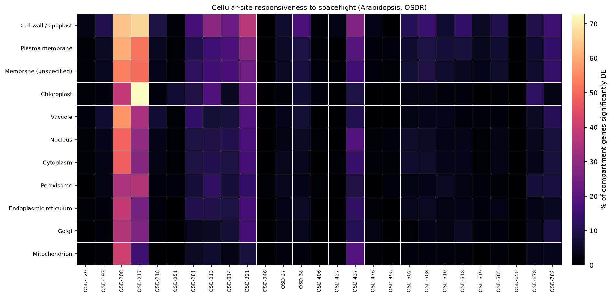
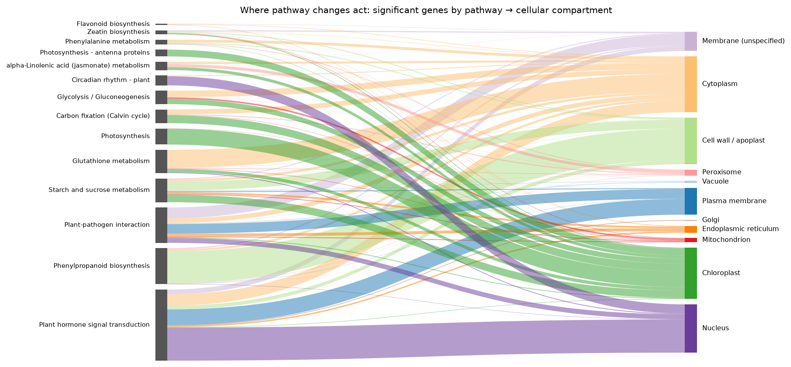
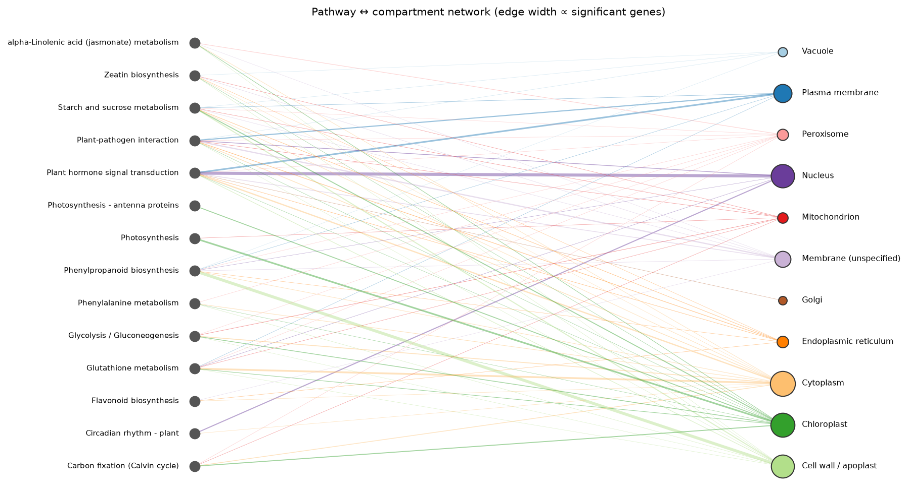

# Results

Projection across **27 studies** and **14 pathways**.

## Pathway activity heatmap

## Most-perturbed pathway per study

| Study | Top pathway (most significant genes) | sig genes |
| --- | --- | --- |
| OSD-120 | Plant hormone signal transduction | 9 |
| OSD-193 | Plant hormone signal transduction | 17 |
| OSD-208 | Plant hormone signal transduction | 178 |
| OSD-217 | Plant hormone signal transduction | 189 |
| OSD-218 | Phenylpropanoid biosynthesis | 16 |
| OSD-251 | Plant hormone signal transduction | 5 |
| OSD-281 | Plant hormone signal transduction | 37 |
| OSD-313 | Plant hormone signal transduction | 73 |
| OSD-314 | Plant hormone signal transduction | 68 |
| OSD-321 | Plant hormone signal transduction | 103 |
| OSD-346 | Starch and sucrose metabolism | 1 |
| OSD-37 | Plant hormone signal transduction | 14 |
| OSD-38 | Starch and sucrose metabolism | 28 |
| OSD-406 | Plant hormone signal transduction | 13 |
| OSD-427 | Phenylpropanoid biosynthesis | 5 |
| OSD-437 | Plant hormone signal transduction | 84 |
| OSD-476 | Plant-pathogen interaction | 5 |
| OSD-498 | Plant-pathogen interaction | 9 |
| OSD-502 | Plant hormone signal transduction | 15 |
| OSD-508 | Plant hormone signal transduction | 23 |
| OSD-510 | Plant-pathogen interaction | 18 |
| OSD-518 | Plant hormone signal transduction | 25 |
| OSD-519 | Phenylpropanoid biosynthesis | 9 |
| OSD-565 | Plant-pathogen interaction | 17 |
| OSD-658 | Glycolysis / Gluconeogenesis | 0 |
| OSD-678 | Photosynthesis | 25 |
| OSD-782 | Plant hormone signal transduction | 40 |

## Cellular-site responsiveness

For each subcellular compartment, the fraction of that compartment's expressed genes that are significantly differentially expressed (|log2FC| > 1, adj. *p* < 0.05), averaged across studies. Enrichment is relative to each study's genome-wide rate. Compartments (UniProt) for ~12,500 Arabidopsis genes.

| Compartment | Mean % genes DE | Enrichment vs genome |
| --- | --- | --- |
| Cell wall / apoplast | 14.8 | ×2.06 |
| Plasma membrane | 10.9 | ×1.35 |
| Membrane (unspecified) | 10.1 | ×1.28 |
| Chloroplast | 8.2 | ×0.84 |
| Vacuole | 7.6 | ×0.94 |
| Nucleus | 7.4 | ×0.89 |
| Cytoplasm | 6.9 | ×0.81 |
| Peroxisome | 6.3 | ×0.90 |
| Endoplasmic reticulum | 6.1 | ×0.68 |
| Golgi | 5.5 | ×0.63 |
| Mitochondrion | 4.5 | ×0.45 |

*Compartments are from UniProt. Organelle membranes (chloroplast, mitochondrion, ER, Golgi, vacuole/tonoplast) are counted **with their organelle**; **Plasma membrane** is UniProt "Cell membrane"; **Membrane (unspecified)** is membrane-annotated proteins with no organelle specified.*

## Subcellular localisation of pathway changes

Where do the significant genes of each pathway act? These holistic views aggregate significant-gene events across all studies.

### Pathway → compartment (Sankey)

[Open the interactive Sankey](_static/sankey_pathway_compartment.html)

### Pathway ↔ compartment network

### Knowledge graph (graph database)

The full Gene–Pathway–Compartment–Study graph is exported for graph databases: `graph_db/spaceflight_atlas.graphml` (Cytoscape/Gephi/yEd) and `graph_db/{nodes,edges}.csv` + `import.cypher` (Neo4j).
