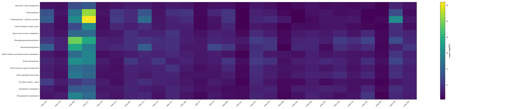

# Results

Projection across **27 studies** and **14 pathways**.

## Pathway activity heatmap

## Most-perturbed pathway per study

| Study | Top pathway (most significant genes) | sig genes |
| --- | --- | --- |
| OSD-120 | Plant hormone signal transduction | 9 |
| OSD-193 | Plant hormone signal transduction | 17 |
| OSD-208 | Plant hormone signal transduction | 178 |
| OSD-217 | Plant hormone signal transduction | 189 |
| OSD-218 | Phenylpropanoid biosynthesis | 16 |
| OSD-251 | Plant hormone signal transduction | 5 |
| OSD-281 | Plant hormone signal transduction | 37 |
| OSD-313 | Plant hormone signal transduction | 73 |
| OSD-314 | Plant hormone signal transduction | 68 |
| OSD-321 | Plant hormone signal transduction | 103 |
| OSD-346 | Starch and sucrose metabolism | 1 |
| OSD-37 | Plant hormone signal transduction | 14 |
| OSD-38 | Starch and sucrose metabolism | 28 |
| OSD-406 | Plant hormone signal transduction | 13 |
| OSD-427 | Phenylpropanoid biosynthesis | 5 |
| OSD-437 | Plant hormone signal transduction | 84 |
| OSD-476 | Plant-pathogen interaction | 5 |
| OSD-498 | Plant-pathogen interaction | 9 |
| OSD-502 | Plant hormone signal transduction | 15 |
| OSD-508 | Plant hormone signal transduction | 23 |
| OSD-510 | Plant-pathogen interaction | 18 |
| OSD-518 | Plant hormone signal transduction | 25 |
| OSD-519 | Phenylpropanoid biosynthesis | 9 |
| OSD-565 | Plant-pathogen interaction | 17 |
| OSD-658 | Glycolysis / Gluconeogenesis | 0 |
| OSD-678 | Photosynthesis | 25 |
| OSD-782 | Plant hormone signal transduction | 40 |
