# OSD-208

**Comparing RNA-Seq and microarray gene expression data in two zones of the Arabidopsis root apex relevant to spaceflight.**

- Organism: *Arabidopsis thaliana*
- Contrast: `(ROOT ZONE I (0.5mm))v(ROOT ZONE II (1.5mm))`
- [Study on OSDR](https://osdr.nasa.gov/bio/repo/data/studies/OSD-208)
- [Open in the interactive viewer](https://dr-richard-barker.github.io/SBGN-Pathway-viewer/app/) — Import from OSDR → Curated → OSD-208

## Pathway projection

| KEGG | Pathway | genes | mapped | cov % | up | down | sig | mean|log2FC| |
| --- | --- | --- | --- | --- | --- | --- | --- | --- |
| ath00010 | Glycolysis / Gluconeogenesis | 161 | 108 | 67.1 | 24 | 22 | 43 | 1.498 |
| ath00195 | Photosynthesis | 85 | 42 | 49.4 | 5 | 26 | 26 | 2.469 |
| ath00196 | Photosynthesis - antenna proteins | 52 | 20 | 38.5 | 1 | 18 | 15 | 2.996 |
| ath00710 | Carbon fixation (Calvin cycle) | 72 | 67 | 93.1 | 7 | 22 | 24 | 1.436 |
| ath00500 | Starch and sucrose metabolism | 237 | 139 | 58.6 | 33 | 52 | 72 | 2.136 |
| ath00940 | Phenylpropanoid biosynthesis | 144 | 97 | 67.4 | 10 | 75 | 80 | 4.843 |
| ath00941 | Flavonoid biosynthesis | 39 | 16 | 41.0 | 0 | 10 | 10 | 3.73 |
| ath00592 | alpha-Linolenic acid (jasmonate) metabolism | 48 | 35 | 72.9 | 8 | 17 | 25 | 2.258 |
| ath00908 | Zeatin biosynthesis | 35 | 21 | 60.0 | 7 | 6 | 10 | 3.122 |
| ath04075 | Plant hormone signal transduction | 434 | 332 | 76.5 | 52 | 160 | 178 | 2.273 |
| ath04626 | Plant-pathogen interaction | 258 | 167 | 64.7 | 22 | 92 | 99 | 2.475 |
| ath04712 | Circadian rhythm - plant | 43 | 40 | 93.0 | 3 | 12 | 11 | 1.057 |
| ath00480 | Glutathione metabolism | 122 | 89 | 73.0 | 9 | 40 | 46 | 1.805 |
| ath00360 | Phenylalanine metabolism | 91 | 30 | 33.0 | 8 | 12 | 16 | 2.826 |

## Static pathway projections

Each panel: the study's data projected onto the KEGG pathway (left; red = up, blue = down) beside a heatmap of that pathway's significant loci (right, log2FC).

### ath04075 — Plant hormone signal transduction  ·  178 significant genes

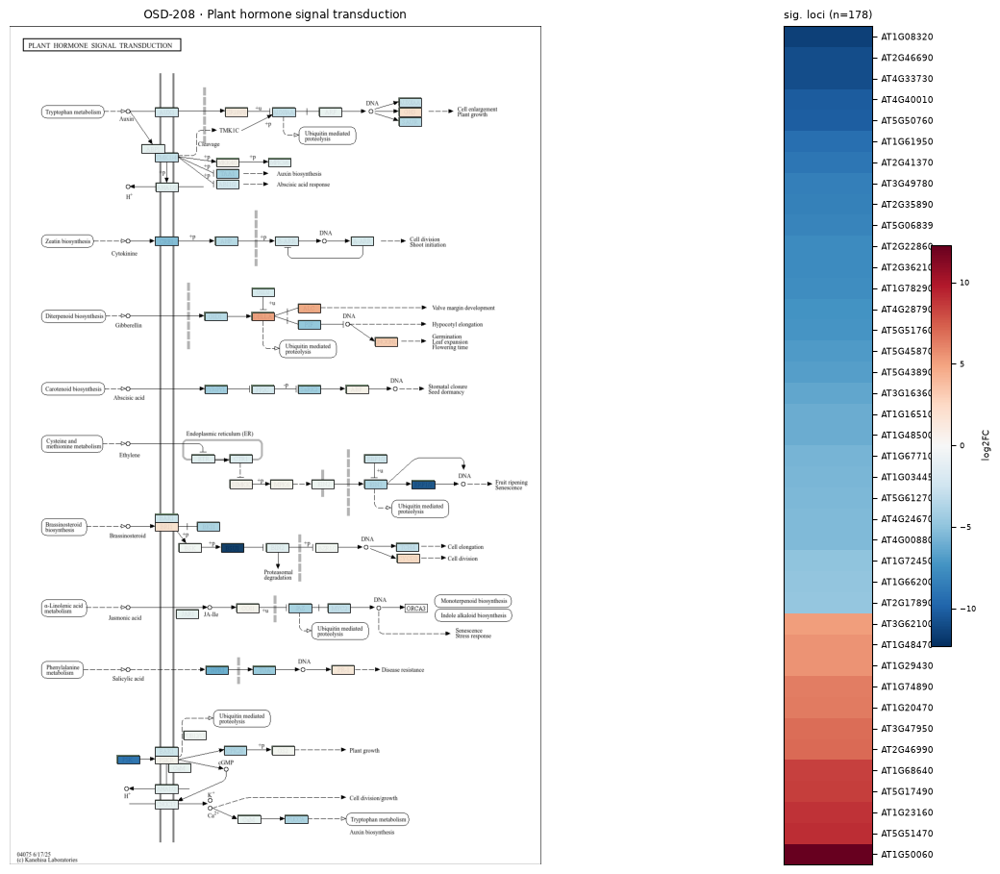

### ath04626 — Plant-pathogen interaction  ·  99 significant genes

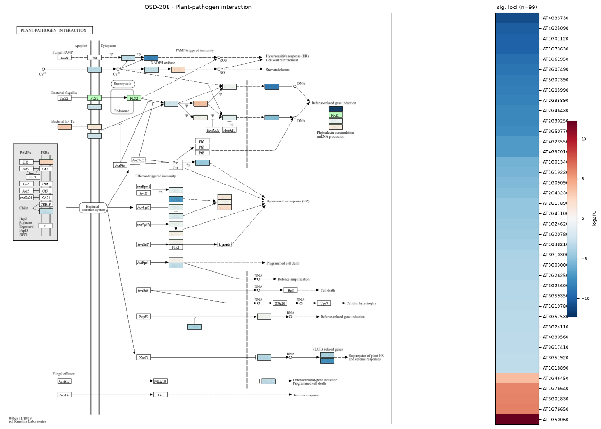

### ath00940 — Phenylpropanoid biosynthesis  ·  80 significant genes

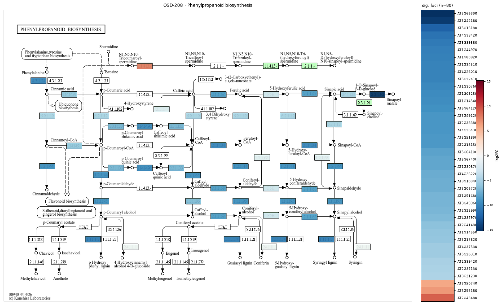

### ath00500 — Starch and sucrose metabolism  ·  72 significant genes

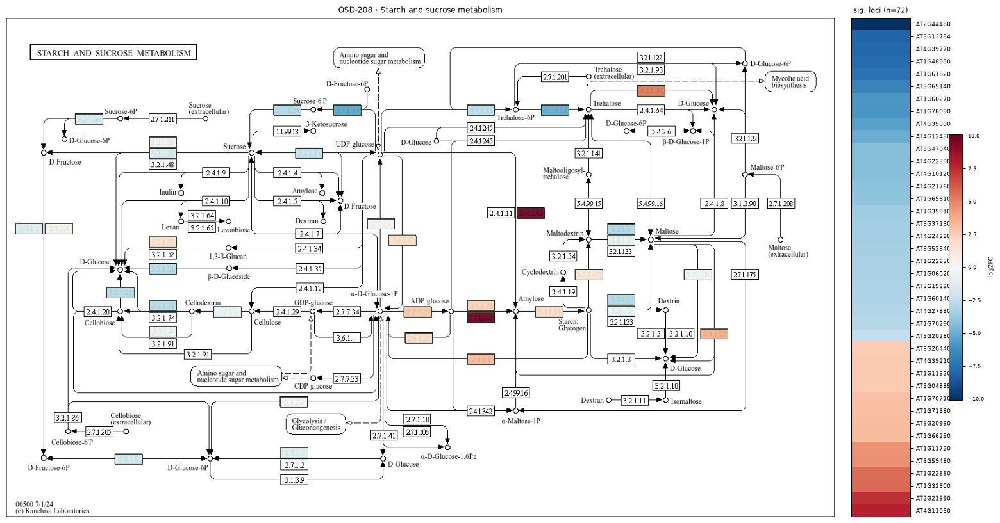

### ath00480 — Glutathione metabolism  ·  46 significant genes

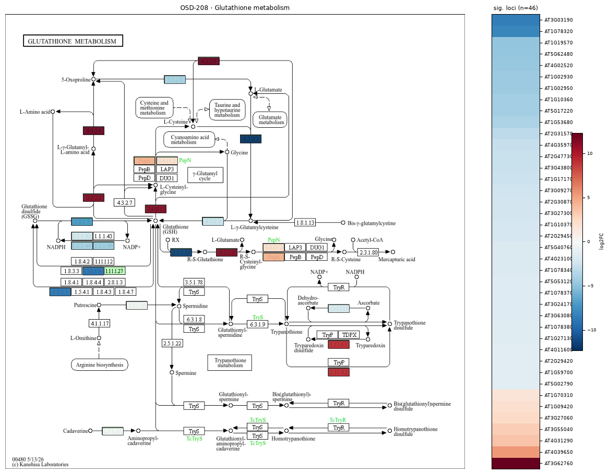

### ath00010 — Glycolysis / Gluconeogenesis  ·  43 significant genes

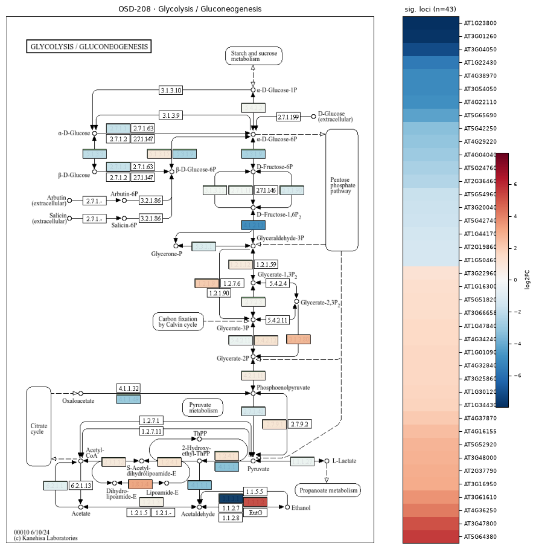

### ath00195 — Photosynthesis  ·  26 significant genes

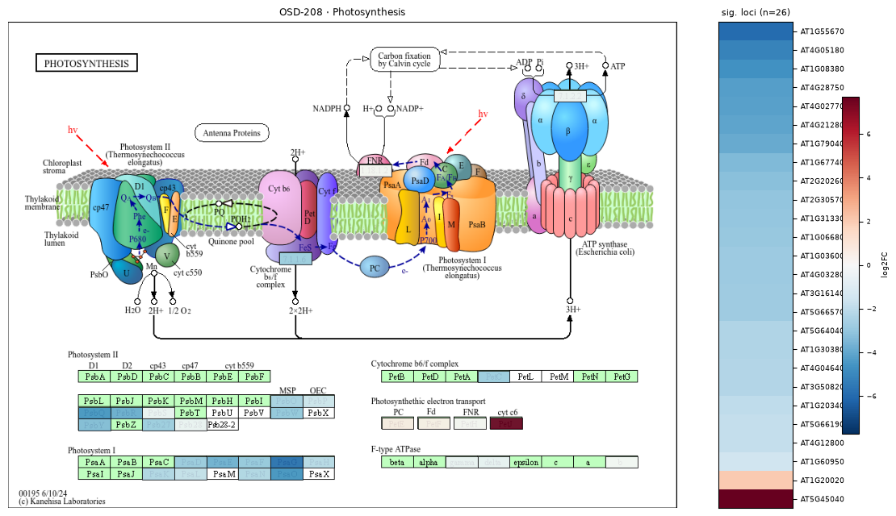

### ath00592 — alpha-Linolenic acid (jasmonate) metabolism  ·  25 significant genes

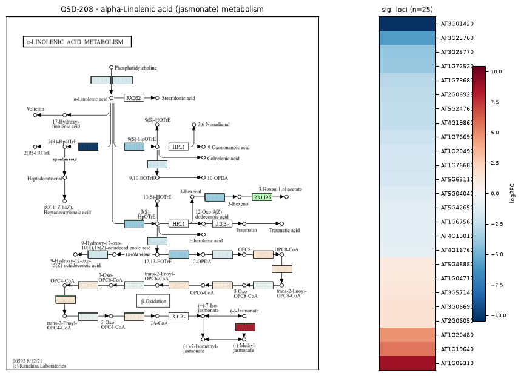

### ath00710 — Carbon fixation (Calvin cycle)  ·  24 significant genes

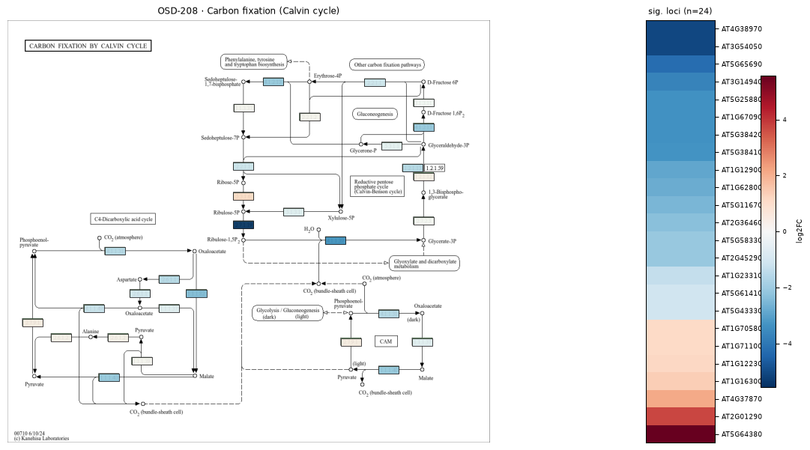

### ath00360 — Phenylalanine metabolism  ·  16 significant genes

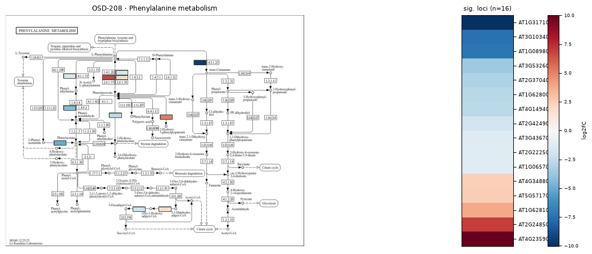

### ath00196 — Photosynthesis - antenna proteins  ·  15 significant genes

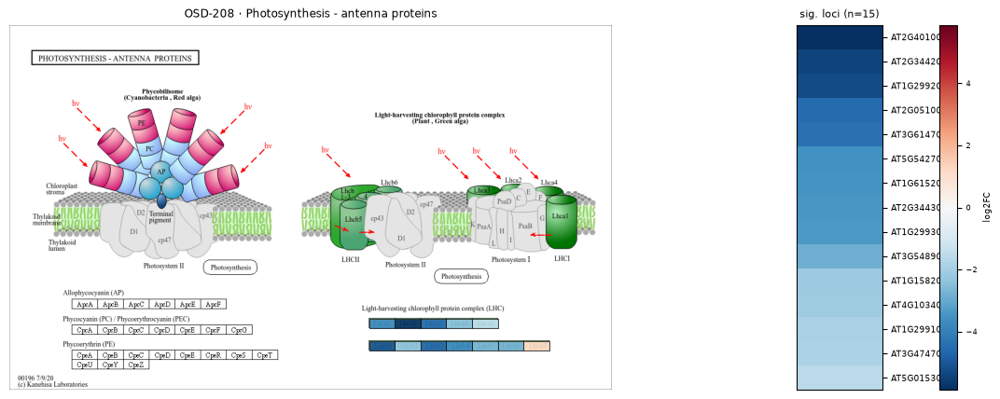

### ath04712 — Circadian rhythm - plant  ·  11 significant genes

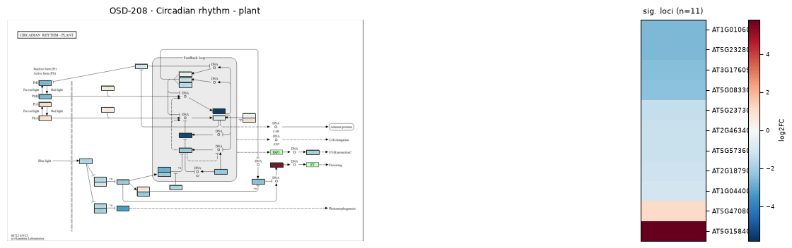

### ath00941 — Flavonoid biosynthesis  ·  10 significant genes

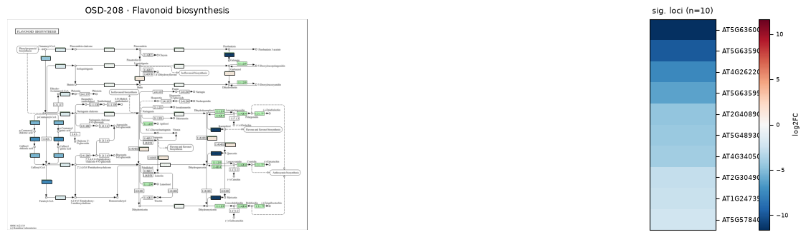

### ath00908 — Zeatin biosynthesis  ·  10 significant genes

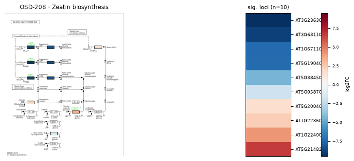
