# OSD-217

**Characterization of Epigenetic Regulation in an Extraterrestrial Environment: The Arabidopsis Spaceflight Methylome**

- Organism: *Arabidopsis thaliana*
- Contrast: `(leaf & Ground Control)v(leaf & Space Flight)`
- [Study on OSDR](https://osdr.nasa.gov/bio/repo/data/studies/OSD-217)
- [Open in the interactive viewer](https://dr-richard-barker.github.io/SBGN-Pathway-viewer/app/) — Import from OSDR → Curated → OSD-217

## Pathway projection

| KEGG | Pathway | genes | mapped | cov % | up | down | sig | mean|log2FC| |
| --- | --- | --- | --- | --- | --- | --- | --- | --- |
| ath00010 | Glycolysis / Gluconeogenesis | 161 | 117 | 72.7 | 25 | 30 | 54 | 1.749 |
| ath00195 | Photosynthesis | 85 | 44 | 51.8 | 2 | 40 | 42 | 5.259 |
| ath00196 | Photosynthesis - antenna proteins | 52 | 21 | 40.4 | 0 | 21 | 21 | 6.199 |
| ath00710 | Carbon fixation (Calvin cycle) | 72 | 70 | 97.2 | 14 | 30 | 44 | 2.964 |
| ath00500 | Starch and sucrose metabolism | 237 | 161 | 67.9 | 51 | 56 | 101 | 2.208 |
| ath00940 | Phenylpropanoid biosynthesis | 144 | 127 | 88.2 | 72 | 20 | 87 | 3.742 |
| ath00941 | Flavonoid biosynthesis | 39 | 21 | 53.8 | 15 | 1 | 15 | 2.696 |
| ath00592 | alpha-Linolenic acid (jasmonate) metabolism | 48 | 45 | 93.8 | 9 | 19 | 28 | 2.861 |
| ath00908 | Zeatin biosynthesis | 35 | 28 | 80.0 | 9 | 12 | 19 | 2.841 |
| ath04075 | Plant hormone signal transduction | 434 | 388 | 89.4 | 103 | 96 | 189 | 2.066 |
| ath04626 | Plant-pathogen interaction | 258 | 199 | 77.1 | 44 | 60 | 92 | 2.134 |
| ath04712 | Circadian rhythm - plant | 43 | 43 | 100.0 | 2 | 15 | 17 | 1.392 |
| ath00480 | Glutathione metabolism | 122 | 100 | 82.0 | 28 | 24 | 51 | 1.95 |
| ath00360 | Phenylalanine metabolism | 91 | 31 | 34.1 | 8 | 8 | 16 | 2.238 |

## Static pathway projections

Each panel: the study's data projected onto the KEGG pathway (left; red = up, blue = down) beside a heatmap of that pathway's significant loci (right, log2FC).

### ath04075 — Plant hormone signal transduction  ·  189 significant genes

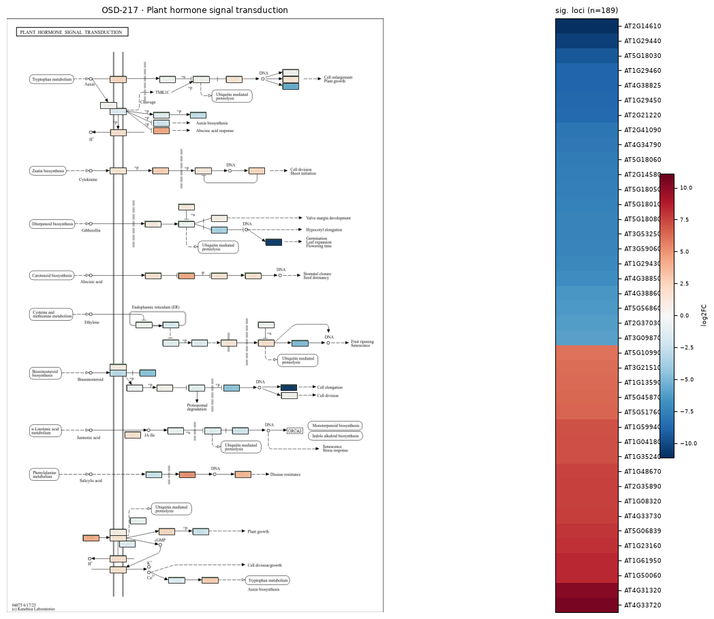

### ath00500 — Starch and sucrose metabolism  ·  101 significant genes

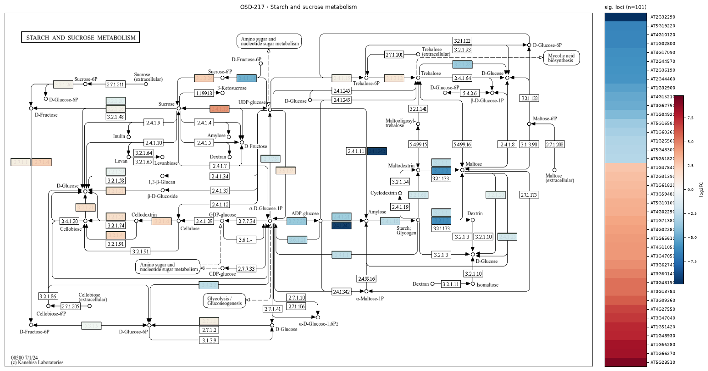

### ath04626 — Plant-pathogen interaction  ·  92 significant genes

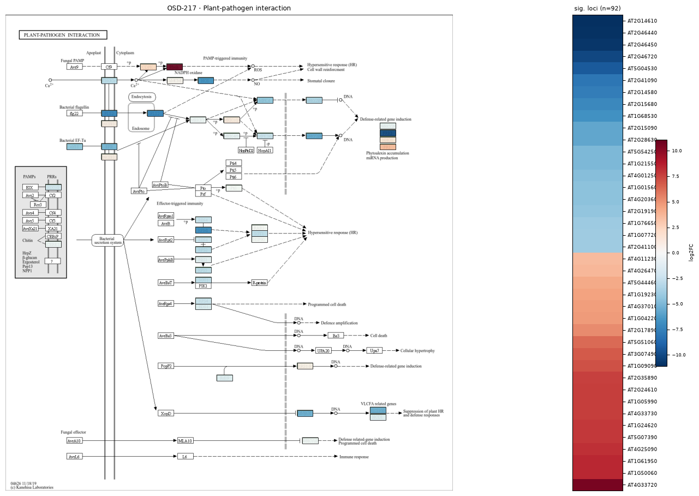

### ath00940 — Phenylpropanoid biosynthesis  ·  87 significant genes

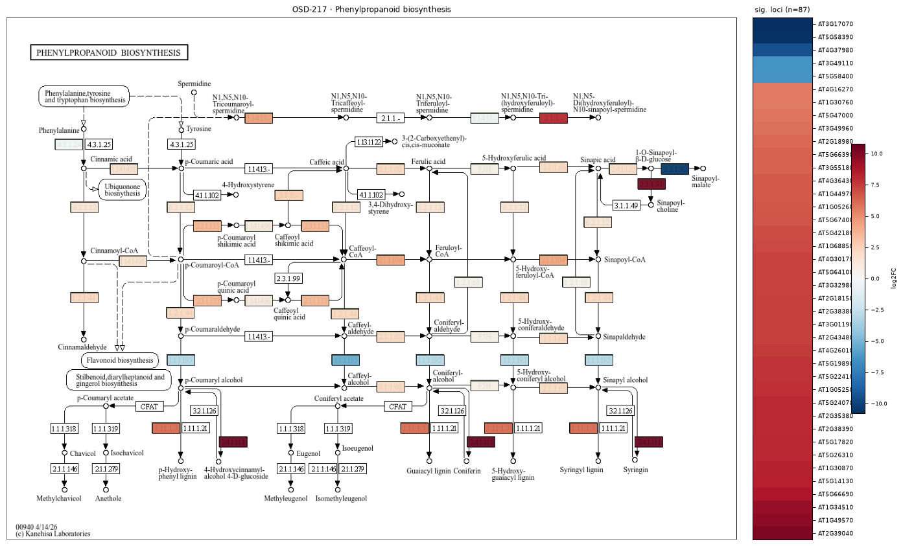

### ath00010 — Glycolysis / Gluconeogenesis  ·  54 significant genes

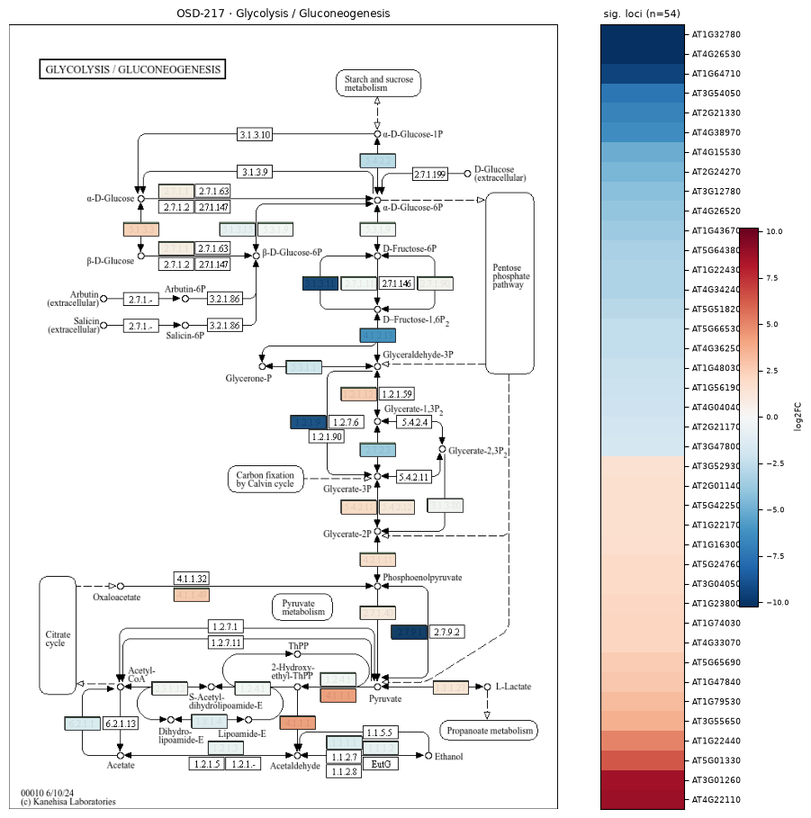

### ath00480 — Glutathione metabolism  ·  51 significant genes

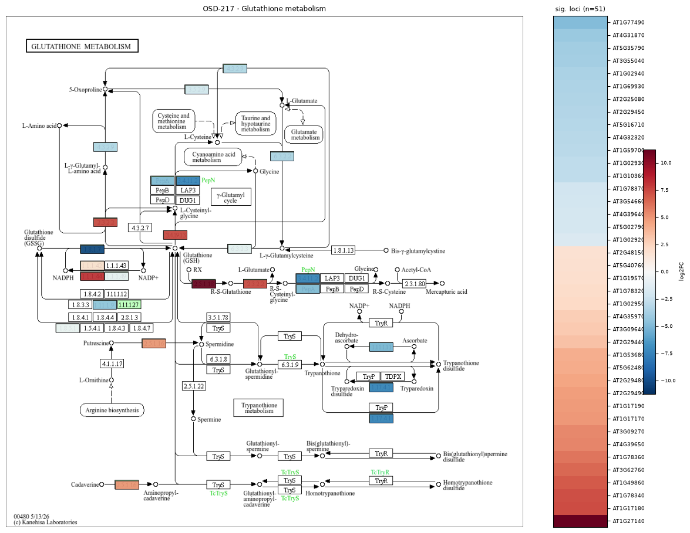

### ath00710 — Carbon fixation (Calvin cycle)  ·  44 significant genes

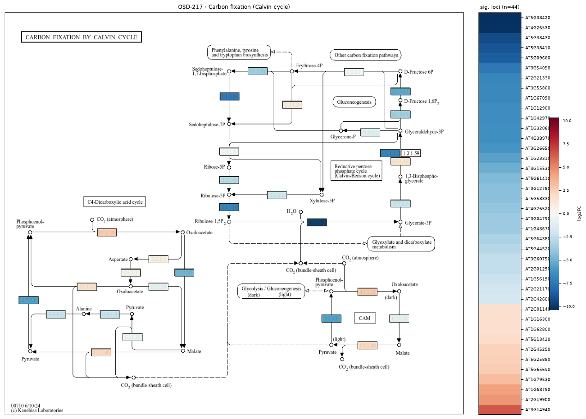

### ath00195 — Photosynthesis  ·  42 significant genes

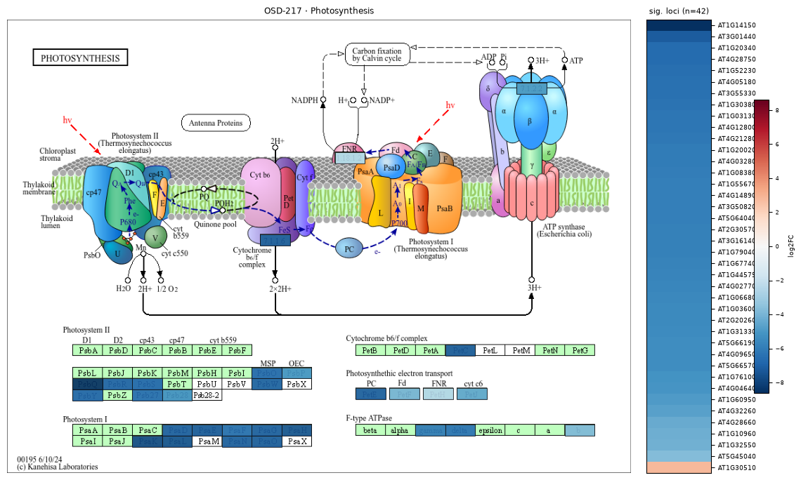

### ath00592 — alpha-Linolenic acid (jasmonate) metabolism  ·  28 significant genes

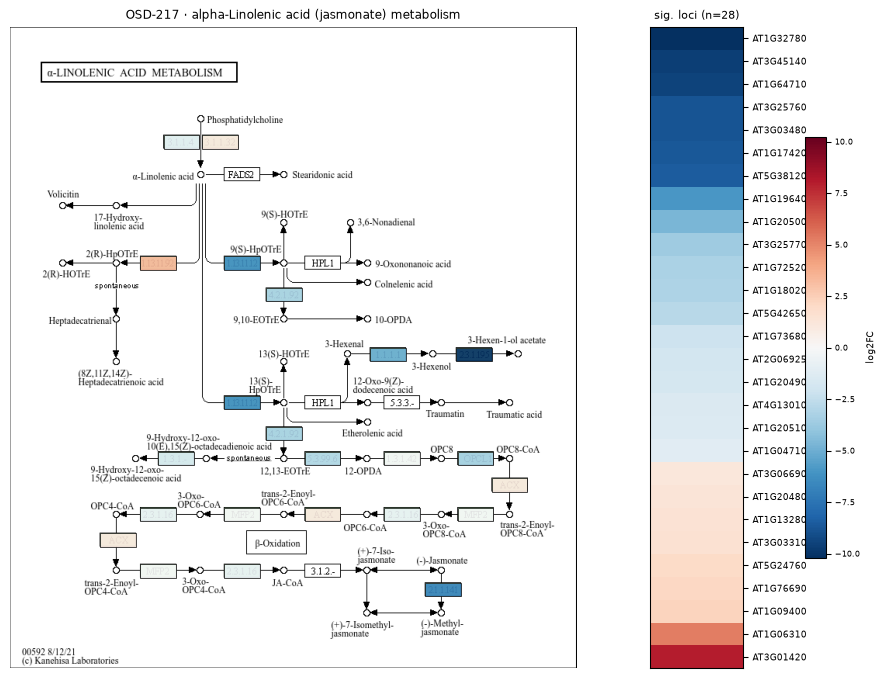

### ath00196 — Photosynthesis - antenna proteins  ·  21 significant genes

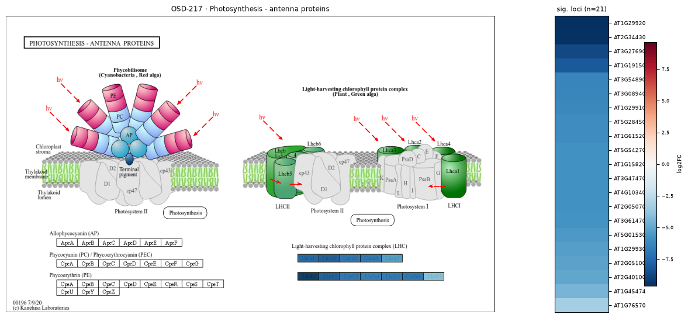

### ath00908 — Zeatin biosynthesis  ·  19 significant genes

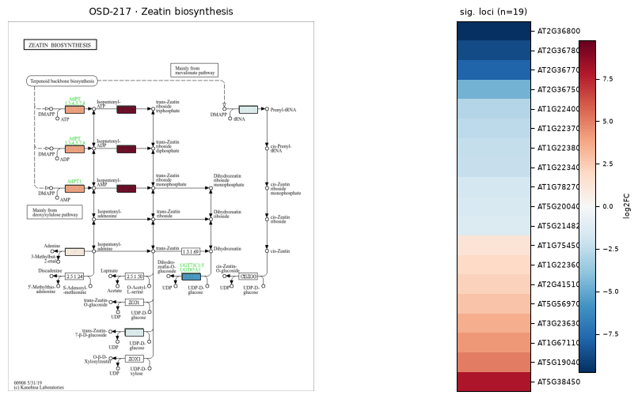

### ath04712 — Circadian rhythm - plant  ·  17 significant genes

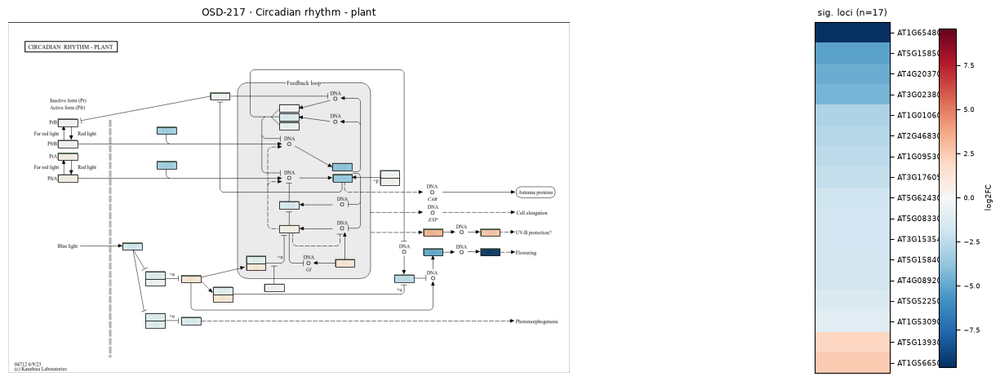

### ath00360 — Phenylalanine metabolism  ·  16 significant genes

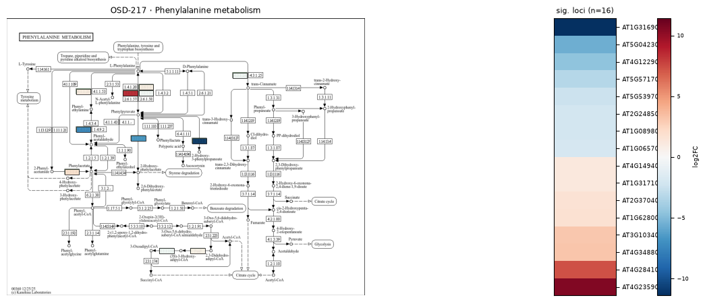

### ath00941 — Flavonoid biosynthesis  ·  15 significant genes

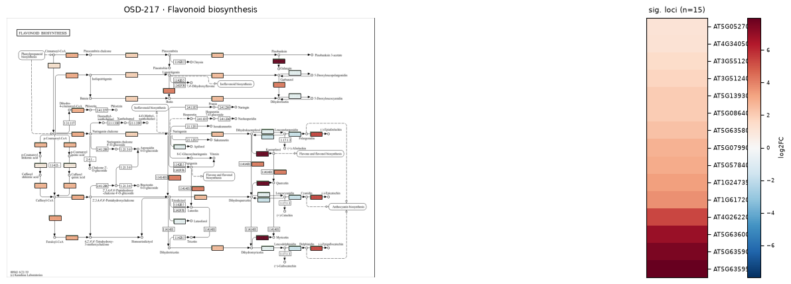
