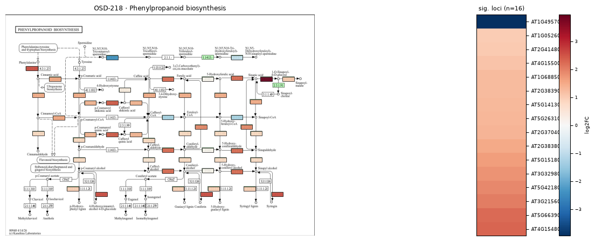
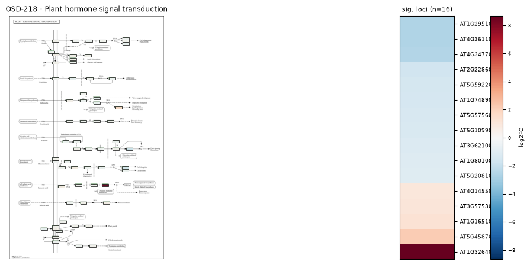
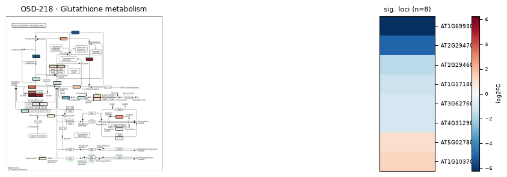
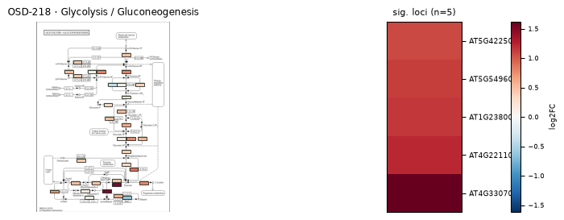
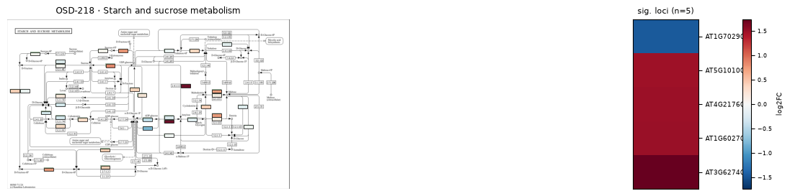
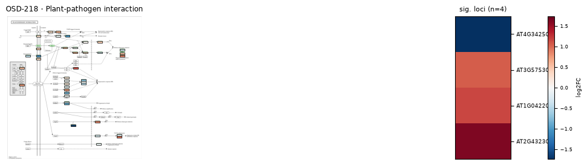
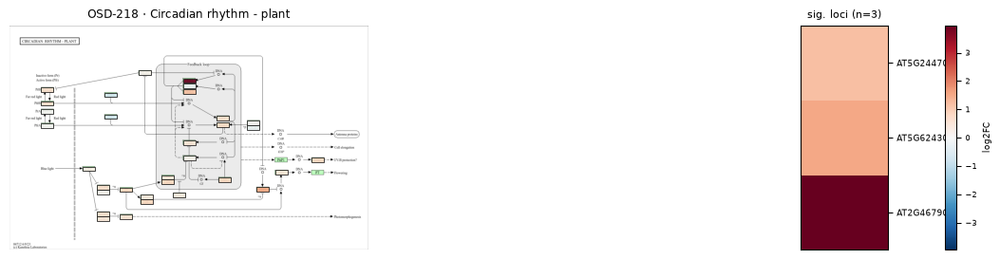

# OSD-218

**Plant development on ISS differs from the development on the ground and is influenced by the genetic background**

- Organism: *Arabidopsis thaliana*
- Contrast: `(Col-0 & 4 day & Ground Control)v(Col-0 & 4 day & Space Flight)`
- [Study on OSDR](https://osdr.nasa.gov/bio/repo/data/studies/OSD-218)
- [Open in the interactive viewer](https://dr-richard-barker.github.io/SBGN-Pathway-viewer/app/) — Import from OSDR → Curated → OSD-218

## Pathway projection

| KEGG | Pathway | genes | mapped | cov % | up | down | sig | mean|log2FC| |
| --- | --- | --- | --- | --- | --- | --- | --- | --- |
| ath00010 | Glycolysis / Gluconeogenesis | 161 | 111 | 68.9 | 5 | 1 | 5 | 0.344 |
| ath00195 | Photosynthesis | 85 | 43 | 50.6 | 0 | 0 | 0 | 0.424 |
| ath00196 | Photosynthesis - antenna proteins | 52 | 19 | 36.5 | 0 | 0 | 0 | 0.342 |
| ath00710 | Carbon fixation (Calvin cycle) | 72 | 68 | 94.4 | 0 | 0 | 0 | 0.318 |
| ath00500 | Starch and sucrose metabolism | 237 | 147 | 62.0 | 8 | 4 | 5 | 0.457 |
| ath00940 | Phenylpropanoid biosynthesis | 144 | 111 | 77.1 | 15 | 5 | 16 | 0.65 |
| ath00941 | Flavonoid biosynthesis | 39 | 18 | 46.2 | 1 | 1 | 1 | 0.662 |
| ath00592 | alpha-Linolenic acid (jasmonate) metabolism | 48 | 37 | 77.1 | 1 | 1 | 1 | 0.347 |
| ath00908 | Zeatin biosynthesis | 35 | 22 | 62.9 | 1 | 2 | 0 | 0.553 |
| ath04075 | Plant hormone signal transduction | 434 | 338 | 77.9 | 7 | 20 | 16 | 0.442 |
| ath04626 | Plant-pathogen interaction | 258 | 178 | 69.0 | 4 | 3 | 4 | 0.377 |
| ath04712 | Circadian rhythm - plant | 43 | 40 | 93.0 | 3 | 0 | 3 | 0.579 |
| ath00480 | Glutathione metabolism | 122 | 97 | 79.5 | 2 | 8 | 8 | 0.504 |
| ath00360 | Phenylalanine metabolism | 91 | 30 | 33.0 | 1 | 3 | 2 | 0.568 |

## Static pathway projections

Each panel: the study's data projected onto the KEGG pathway (left; red = up, blue = down) beside a heatmap of that pathway's significant loci (right, log2FC).

### ath00940 — Phenylpropanoid biosynthesis  ·  16 significant genes

### ath04075 — Plant hormone signal transduction  ·  16 significant genes

### ath00480 — Glutathione metabolism  ·  8 significant genes

### ath00010 — Glycolysis / Gluconeogenesis  ·  5 significant genes

### ath00500 — Starch and sucrose metabolism  ·  5 significant genes

### ath04626 — Plant-pathogen interaction  ·  4 significant genes

### ath04712 — Circadian rhythm - plant  ·  3 significant genes

