# OSD-281

**During development, the Sku5 mutant roots engage different genes than wild type WS roots, either on the ground or in spaceflight.**

- Organism: *Arabidopsis thaliana*
- Contrast: `(Sku5 & 4 day & Ground Control)v(Sku5 & 4 day & Space Flight)`
- [Study on OSDR](https://osdr.nasa.gov/bio/repo/data/studies/OSD-281)
- [Open in the interactive viewer](https://dr-richard-barker.github.io/SBGN-Pathway-viewer/app/) — Import from OSDR → Curated → OSD-281

## Pathway projection

| KEGG | Pathway | genes | mapped | cov % | up | down | sig | mean|log2FC| |
| --- | --- | --- | --- | --- | --- | --- | --- | --- |
| ath00010 | Glycolysis / Gluconeogenesis | 161 | 112 | 69.6 | 1 | 12 | 9 | 0.562 |
| ath00195 | Photosynthesis | 85 | 46 | 54.1 | 4 | 5 | 4 | 0.857 |
| ath00196 | Photosynthesis - antenna proteins | 52 | 19 | 36.5 | 3 | 4 | 3 | 0.822 |
| ath00710 | Carbon fixation (Calvin cycle) | 72 | 68 | 94.4 | 2 | 8 | 7 | 0.603 |
| ath00500 | Starch and sucrose metabolism | 237 | 159 | 67.1 | 13 | 21 | 18 | 0.926 |
| ath00940 | Phenylpropanoid biosynthesis | 144 | 119 | 82.6 | 23 | 13 | 23 | 0.958 |
| ath00941 | Flavonoid biosynthesis | 39 | 21 | 53.8 | 4 | 1 | 3 | 0.925 |
| ath00592 | alpha-Linolenic acid (jasmonate) metabolism | 48 | 38 | 79.2 | 0 | 5 | 3 | 0.572 |
| ath00908 | Zeatin biosynthesis | 35 | 26 | 74.3 | 1 | 7 | 5 | 1.094 |
| ath04075 | Plant hormone signal transduction | 434 | 359 | 82.7 | 19 | 40 | 37 | 0.711 |
| ath04626 | Plant-pathogen interaction | 258 | 185 | 71.7 | 25 | 6 | 18 | 0.66 |
| ath04712 | Circadian rhythm - plant | 43 | 40 | 93.0 | 6 | 5 | 10 | 0.676 |
| ath00480 | Glutathione metabolism | 122 | 100 | 82.0 | 9 | 6 | 11 | 0.726 |
| ath00360 | Phenylalanine metabolism | 91 | 31 | 34.1 | 4 | 2 | 5 | 0.703 |

## Static pathway projections

Each panel: the study's data projected onto the KEGG pathway (left; red = up, blue = down) beside a heatmap of that pathway's significant loci (right, log2FC).

### ath04075 — Plant hormone signal transduction  ·  37 significant genes

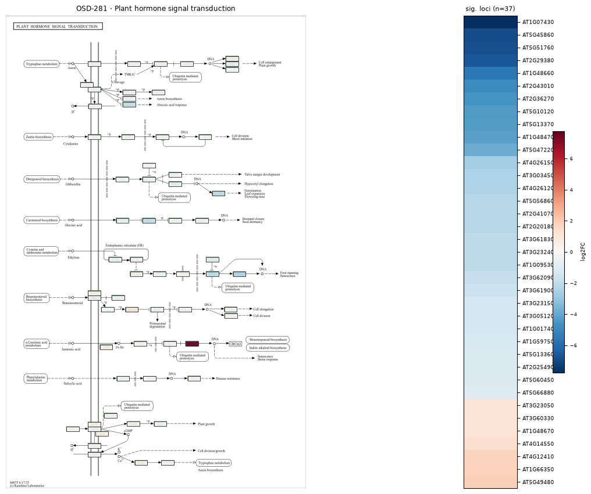

### ath00940 — Phenylpropanoid biosynthesis  ·  23 significant genes

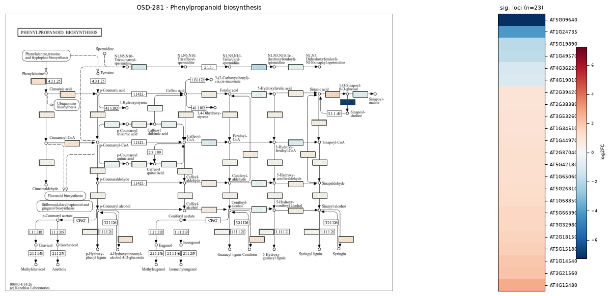

### ath00500 — Starch and sucrose metabolism  ·  18 significant genes

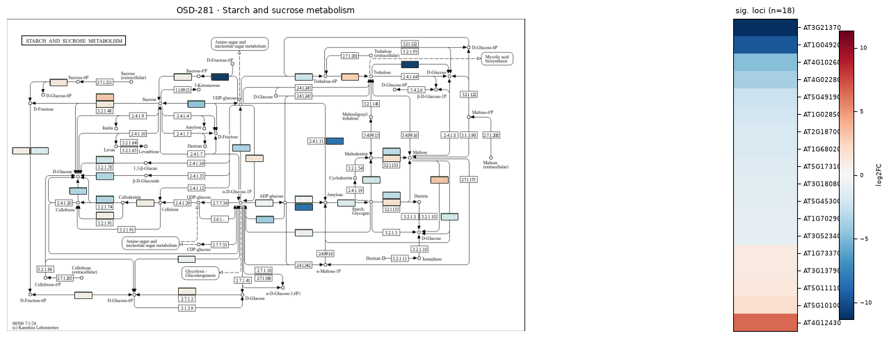

### ath04626 — Plant-pathogen interaction  ·  18 significant genes

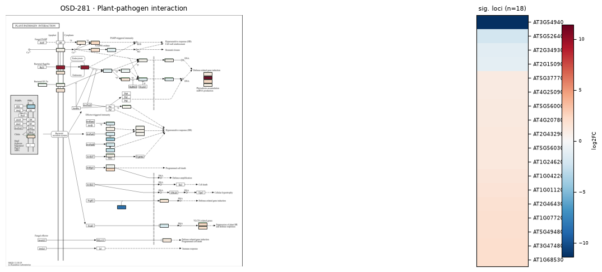

### ath00480 — Glutathione metabolism  ·  11 significant genes

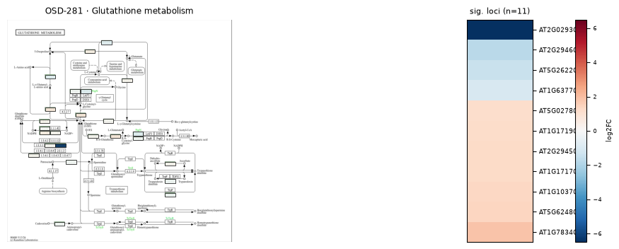

### ath04712 — Circadian rhythm - plant  ·  10 significant genes

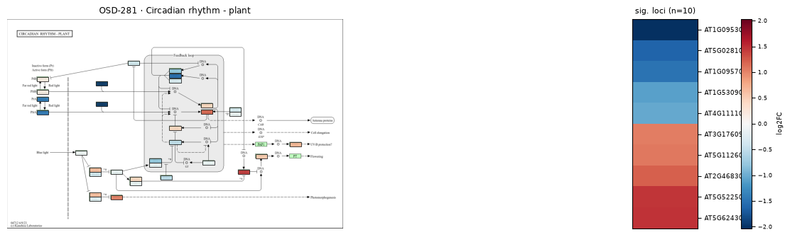

### ath00010 — Glycolysis / Gluconeogenesis  ·  9 significant genes

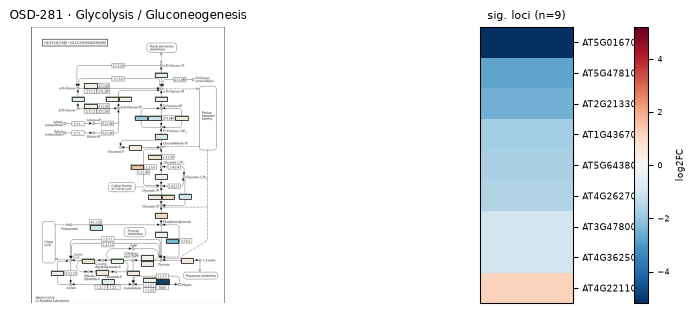

### ath00710 — Carbon fixation (Calvin cycle)  ·  7 significant genes

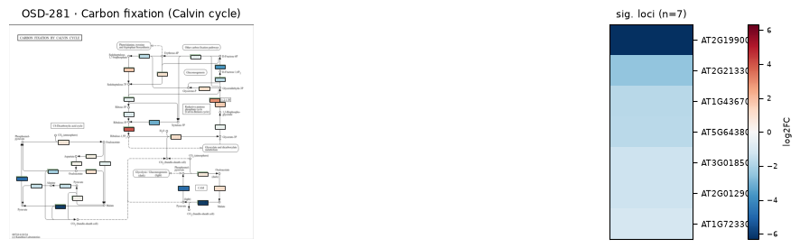

### ath00908 — Zeatin biosynthesis  ·  5 significant genes

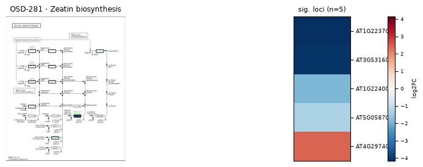

### ath00360 — Phenylalanine metabolism  ·  5 significant genes

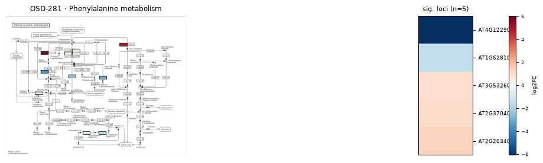

### ath00195 — Photosynthesis  ·  4 significant genes

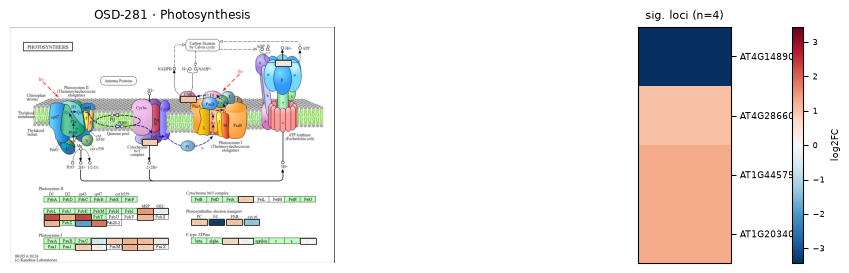

### ath00196 — Photosynthesis - antenna proteins  ·  3 significant genes

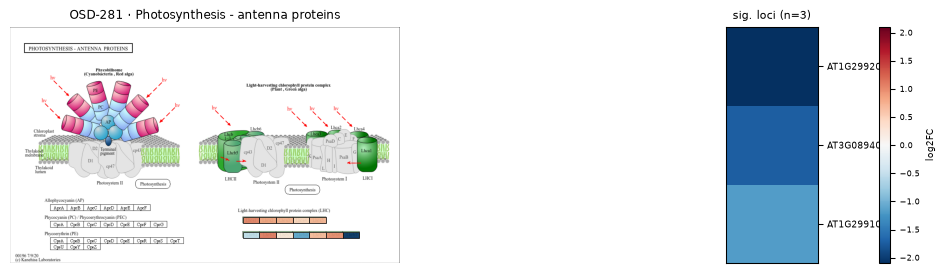

### ath00941 — Flavonoid biosynthesis  ·  3 significant genes

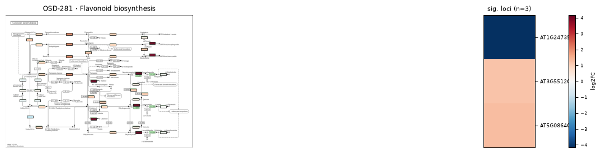

### ath00592 — alpha-Linolenic acid (jasmonate) metabolism  ·  3 significant genes

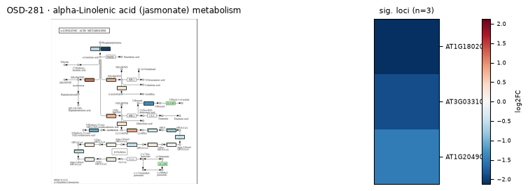
