# OSD-313

**Dissecting transcriptional responses of nucleolin mutants to red light stimulation and darkness in ground reference conditions**

- Organism: *Arabidopsis thaliana*
- Contrast: `(Nuc1-2 Mutant & 48 hours of dark)v(Nuc1-2 Mutant & 48 hours of red light)`
- [Study on OSDR](https://osdr.nasa.gov/bio/repo/data/studies/OSD-313)
- [Open in the interactive viewer](https://dr-richard-barker.github.io/SBGN-Pathway-viewer/app/) — Import from OSDR → Curated → OSD-313

## Pathway projection

| KEGG | Pathway | genes | mapped | cov % | up | down | sig | mean|log2FC| |
| --- | --- | --- | --- | --- | --- | --- | --- | --- |
| ath00010 | Glycolysis / Gluconeogenesis | 161 | 115 | 71.4 | 6 | 9 | 14 | 0.573 |
| ath00195 | Photosynthesis | 85 | 45 | 52.9 | 0 | 32 | 32 | 1.723 |
| ath00196 | Photosynthesis - antenna proteins | 52 | 22 | 42.3 | 0 | 17 | 17 | 2.234 |
| ath00710 | Carbon fixation (Calvin cycle) | 72 | 70 | 97.2 | 1 | 17 | 18 | 0.866 |
| ath00500 | Starch and sucrose metabolism | 237 | 157 | 66.2 | 13 | 15 | 23 | 0.68 |
| ath00940 | Phenylpropanoid biosynthesis | 144 | 117 | 81.2 | 15 | 33 | 45 | 1.052 |
| ath00941 | Flavonoid biosynthesis | 39 | 20 | 51.3 | 2 | 9 | 8 | 1.885 |
| ath00592 | alpha-Linolenic acid (jasmonate) metabolism | 48 | 42 | 87.5 | 5 | 5 | 10 | 0.786 |
| ath00908 | Zeatin biosynthesis | 35 | 27 | 77.1 | 4 | 3 | 5 | 0.692 |
| ath04075 | Plant hormone signal transduction | 434 | 382 | 88.0 | 54 | 29 | 73 | 0.67 |
| ath04626 | Plant-pathogen interaction | 258 | 194 | 75.2 | 19 | 11 | 23 | 0.548 |
| ath04712 | Circadian rhythm - plant | 43 | 42 | 97.7 | 10 | 4 | 12 | 0.908 |
| ath00480 | Glutathione metabolism | 122 | 99 | 81.1 | 8 | 9 | 14 | 0.579 |
| ath00360 | Phenylalanine metabolism | 91 | 31 | 34.1 | 4 | 7 | 9 | 0.788 |

## Static pathway projections

Each panel: the study's data projected onto the KEGG pathway (left; red = up, blue = down) beside a heatmap of that pathway's significant loci (right, log2FC).

### ath04075 — Plant hormone signal transduction  ·  73 significant genes

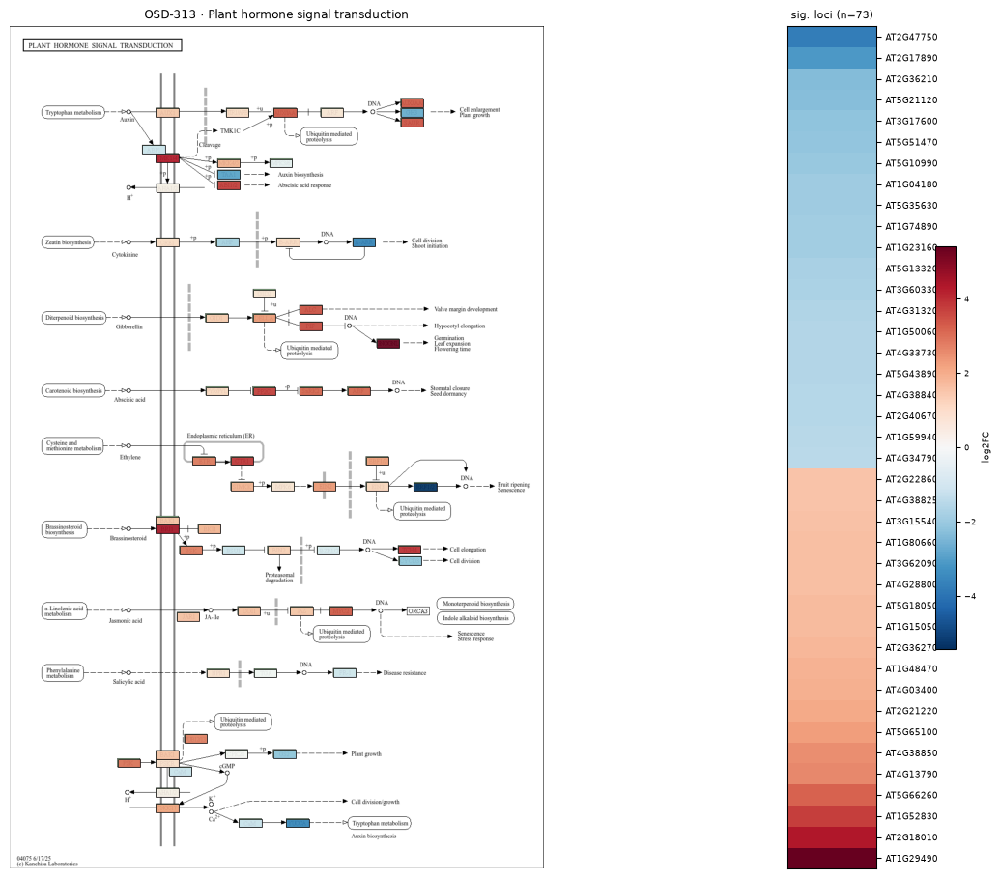

### ath00940 — Phenylpropanoid biosynthesis  ·  45 significant genes

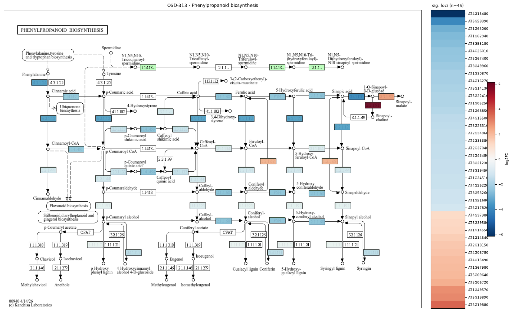

### ath00195 — Photosynthesis  ·  32 significant genes

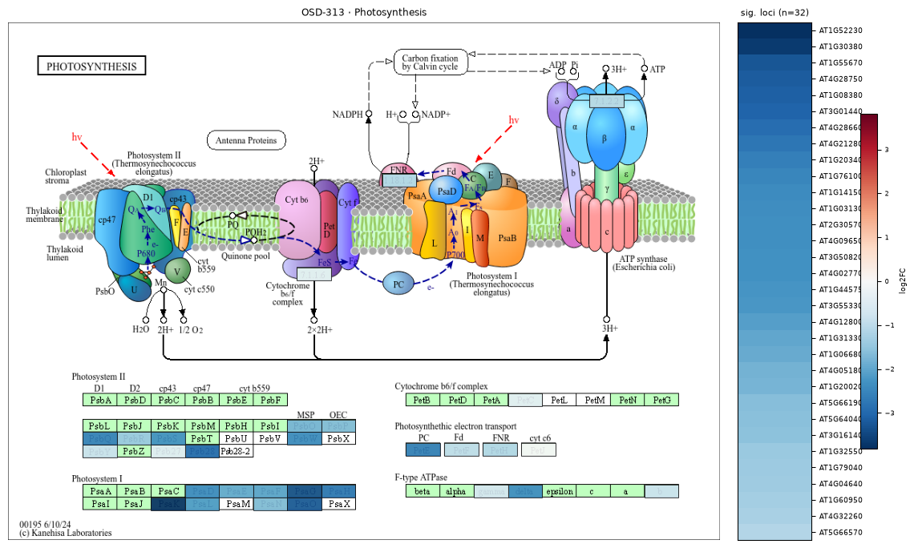

### ath00500 — Starch and sucrose metabolism  ·  23 significant genes

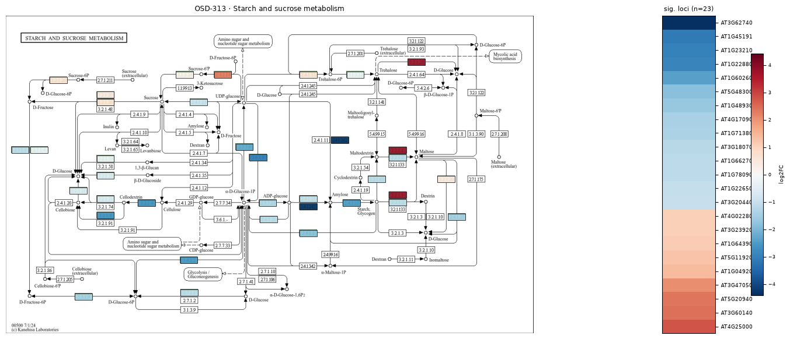

### ath04626 — Plant-pathogen interaction  ·  23 significant genes

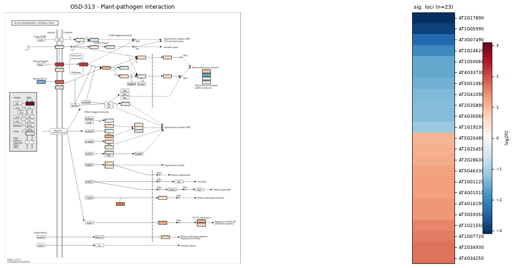

### ath00710 — Carbon fixation (Calvin cycle)  ·  18 significant genes

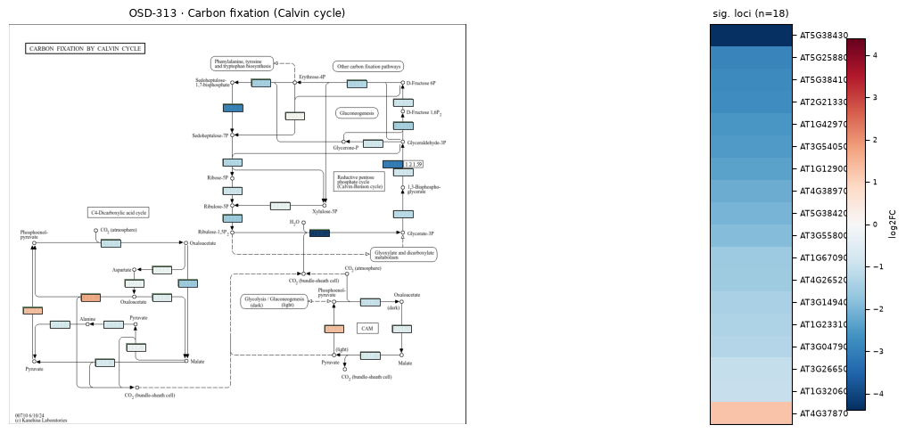

### ath00196 — Photosynthesis - antenna proteins  ·  17 significant genes

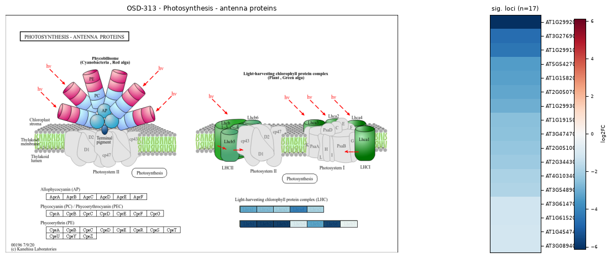

### ath00010 — Glycolysis / Gluconeogenesis  ·  14 significant genes

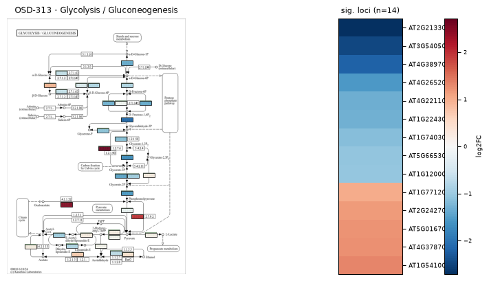

### ath00480 — Glutathione metabolism  ·  14 significant genes

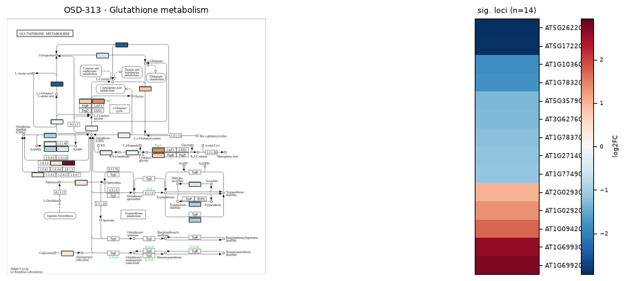

### ath04712 — Circadian rhythm - plant  ·  12 significant genes

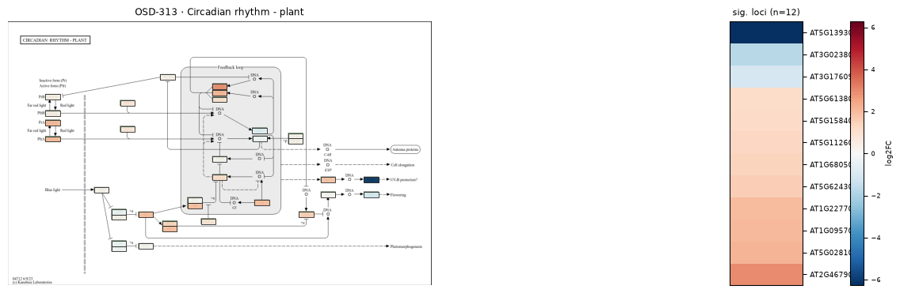

### ath00592 — alpha-Linolenic acid (jasmonate) metabolism  ·  10 significant genes

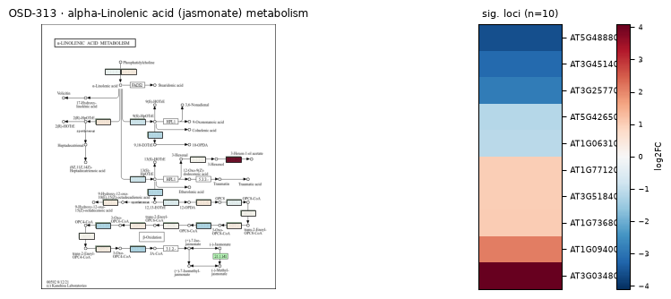

### ath00360 — Phenylalanine metabolism  ·  9 significant genes

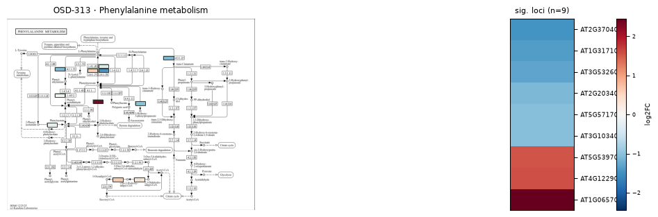

### ath00941 — Flavonoid biosynthesis  ·  8 significant genes

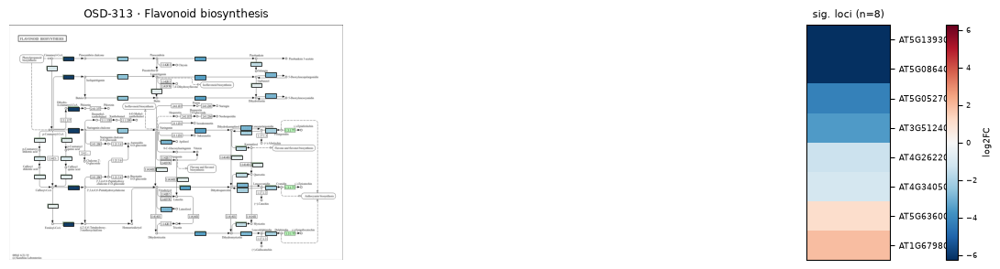

### ath00908 — Zeatin biosynthesis  ·  5 significant genes

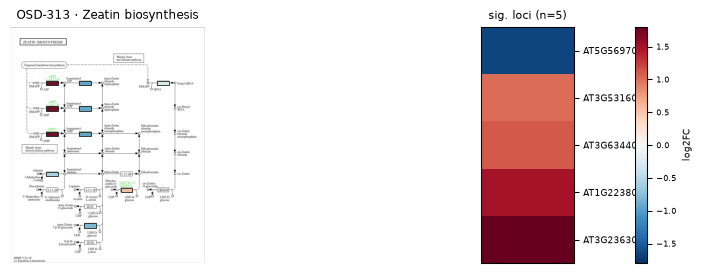
