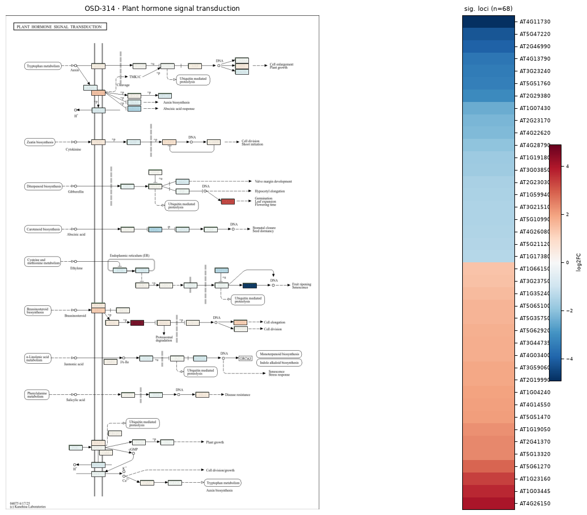
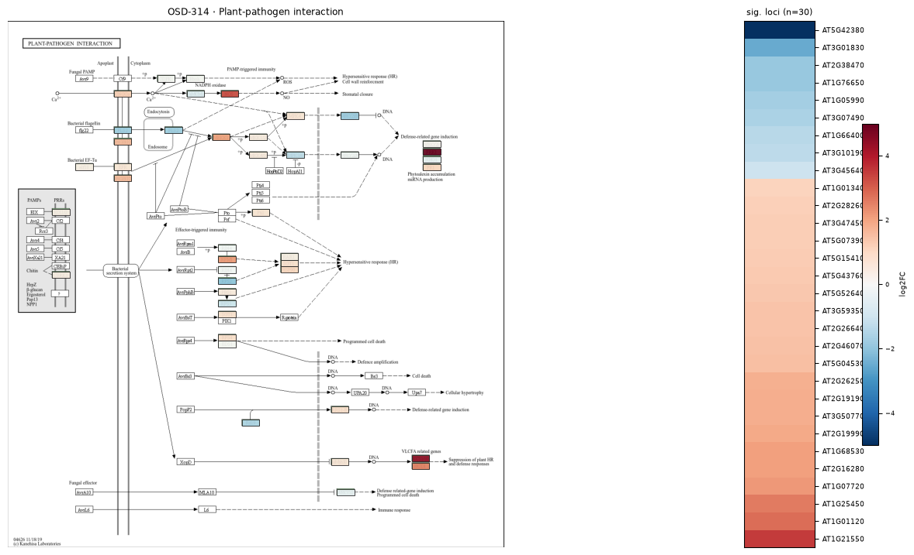
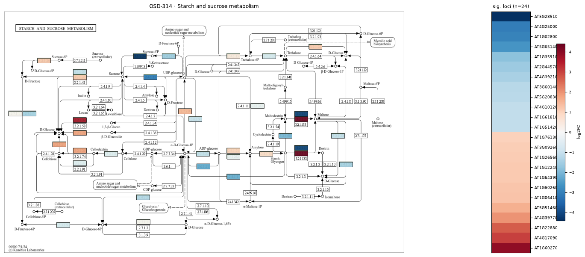
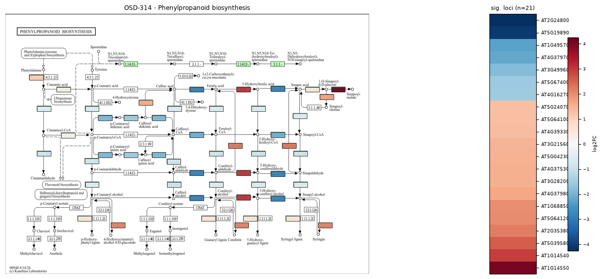
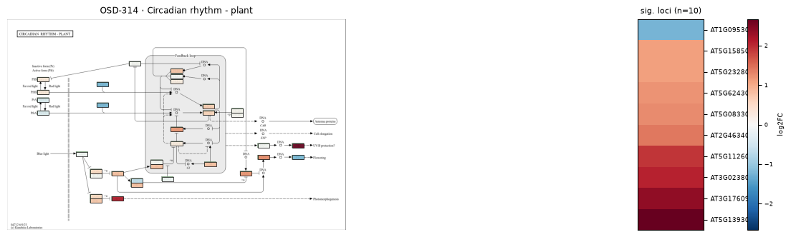
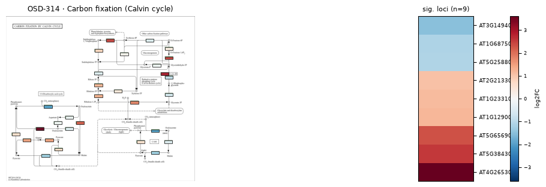
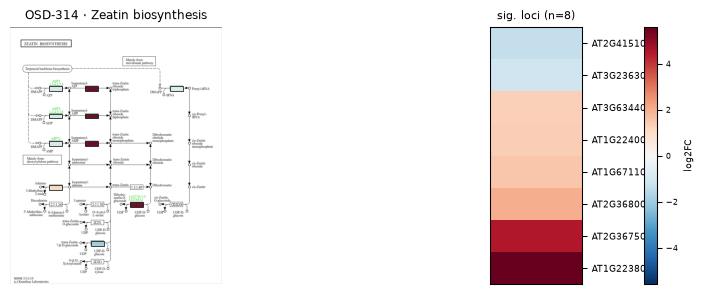
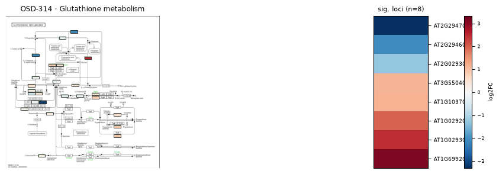
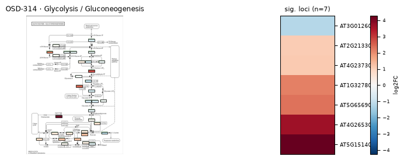
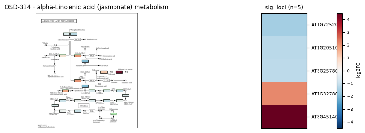

# OSD-314

**Adaptive response of Arabidopsis seedlings in microgravity and Mars reduced gravity environment is enhanced by red light photostimulation**

- Organism: *Arabidopsis thaliana*
- Contrast: `(Ground Control & 1G on Earth & Dark Treatment)v(Space Flight & 0.34G by centrifugation & Dark Treatment)`
- [Study on OSDR](https://osdr.nasa.gov/bio/repo/data/studies/OSD-314)
- [Open in the interactive viewer](https://dr-richard-barker.github.io/SBGN-Pathway-viewer/app/) — Import from OSDR → Curated → OSD-314

## Pathway projection

| KEGG | Pathway | genes | mapped | cov % | up | down | sig | mean|log2FC| |
| --- | --- | --- | --- | --- | --- | --- | --- | --- |
| ath00010 | Glycolysis / Gluconeogenesis | 161 | 115 | 71.4 | 6 | 1 | 7 | 0.405 |
| ath00195 | Photosynthesis | 85 | 45 | 52.9 | 3 | 1 | 2 | 0.433 |
| ath00196 | Photosynthesis - antenna proteins | 52 | 22 | 42.3 | 2 | 1 | 2 | 0.467 |
| ath00710 | Carbon fixation (Calvin cycle) | 72 | 70 | 97.2 | 6 | 3 | 9 | 0.496 |
| ath00500 | Starch and sucrose metabolism | 237 | 158 | 66.7 | 19 | 15 | 24 | 0.69 |
| ath00940 | Phenylpropanoid biosynthesis | 144 | 118 | 81.9 | 20 | 15 | 21 | 0.887 |
| ath00941 | Flavonoid biosynthesis | 39 | 20 | 51.3 | 3 | 2 | 2 | 0.859 |
| ath00592 | alpha-Linolenic acid (jasmonate) metabolism | 48 | 42 | 87.5 | 3 | 4 | 5 | 0.648 |
| ath00908 | Zeatin biosynthesis | 35 | 27 | 77.1 | 8 | 3 | 8 | 1.087 |
| ath04075 | Plant hormone signal transduction | 434 | 385 | 88.7 | 37 | 51 | 68 | 0.704 |
| ath04626 | Plant-pathogen interaction | 258 | 194 | 75.2 | 26 | 13 | 30 | 0.68 |
| ath04712 | Circadian rhythm - plant | 43 | 43 | 100.0 | 9 | 2 | 10 | 0.711 |
| ath00480 | Glutathione metabolism | 122 | 99 | 81.1 | 6 | 6 | 8 | 0.521 |
| ath00360 | Phenylalanine metabolism | 91 | 31 | 34.1 | 2 | 1 | 2 | 0.394 |

## Static pathway projections

Each panel: the study's data projected onto the KEGG pathway (left; red = up, blue = down) beside a heatmap of that pathway's significant loci (right, log2FC).

### ath04075 — Plant hormone signal transduction  ·  68 significant genes

### ath04626 — Plant-pathogen interaction  ·  30 significant genes

### ath00500 — Starch and sucrose metabolism  ·  24 significant genes

### ath00940 — Phenylpropanoid biosynthesis  ·  21 significant genes

### ath04712 — Circadian rhythm - plant  ·  10 significant genes

### ath00710 — Carbon fixation (Calvin cycle)  ·  9 significant genes

### ath00908 — Zeatin biosynthesis  ·  8 significant genes

### ath00480 — Glutathione metabolism  ·  8 significant genes

### ath00010 — Glycolysis / Gluconeogenesis  ·  7 significant genes

### ath00592 — alpha-Linolenic acid (jasmonate) metabolism  ·  5 significant genes

