# OSD-321

**Relevance of Unfolded Protein Response to Spaceflight-Induced Transcriptional Reprogramming in Arabidopsis**

- Organism: *Arabidopsis thaliana*
- Contrast: `(Ground Control & bzip28-2 bzip60-1)v(Space Flight & bzip28-2 bzip60-1)`
- [Study on OSDR](https://osdr.nasa.gov/bio/repo/data/studies/OSD-321)
- [Open in the interactive viewer](https://dr-richard-barker.github.io/SBGN-Pathway-viewer/app/) — Import from OSDR → Curated → OSD-321

## Pathway projection

| KEGG | Pathway | genes | mapped | cov % | up | down | sig | mean|log2FC| |
| --- | --- | --- | --- | --- | --- | --- | --- | --- |
| ath00010 | Glycolysis / Gluconeogenesis | 161 | 116 | 72.0 | 7 | 11 | 17 | 0.546 |
| ath00195 | Photosynthesis | 85 | 45 | 52.9 | 1 | 15 | 16 | 0.94 |
| ath00196 | Photosynthesis - antenna proteins | 52 | 22 | 42.3 | 2 | 6 | 7 | 0.704 |
| ath00710 | Carbon fixation (Calvin cycle) | 72 | 69 | 95.8 | 5 | 9 | 14 | 0.645 |
| ath00500 | Starch and sucrose metabolism | 237 | 160 | 67.5 | 21 | 45 | 55 | 1.041 |
| ath00940 | Phenylpropanoid biosynthesis | 144 | 117 | 81.2 | 12 | 27 | 34 | 0.916 |
| ath00941 | Flavonoid biosynthesis | 39 | 20 | 51.3 | 2 | 3 | 4 | 0.939 |
| ath00592 | alpha-Linolenic acid (jasmonate) metabolism | 48 | 43 | 89.6 | 6 | 3 | 8 | 0.828 |
| ath00908 | Zeatin biosynthesis | 35 | 26 | 74.3 | 2 | 5 | 6 | 0.588 |
| ath04075 | Plant hormone signal transduction | 434 | 393 | 90.6 | 39 | 89 | 103 | 1.002 |
| ath04626 | Plant-pathogen interaction | 258 | 200 | 77.5 | 21 | 27 | 37 | 0.741 |
| ath04712 | Circadian rhythm - plant | 43 | 41 | 95.3 | 3 | 3 | 6 | 0.641 |
| ath00480 | Glutathione metabolism | 122 | 99 | 81.1 | 13 | 6 | 18 | 0.763 |
| ath00360 | Phenylalanine metabolism | 91 | 32 | 35.2 | 6 | 4 | 9 | 0.765 |

## Static pathway projections

Each panel: the study's data projected onto the KEGG pathway (left; red = up, blue = down) beside a heatmap of that pathway's significant loci (right, log2FC).

### ath04075 — Plant hormone signal transduction  ·  103 significant genes

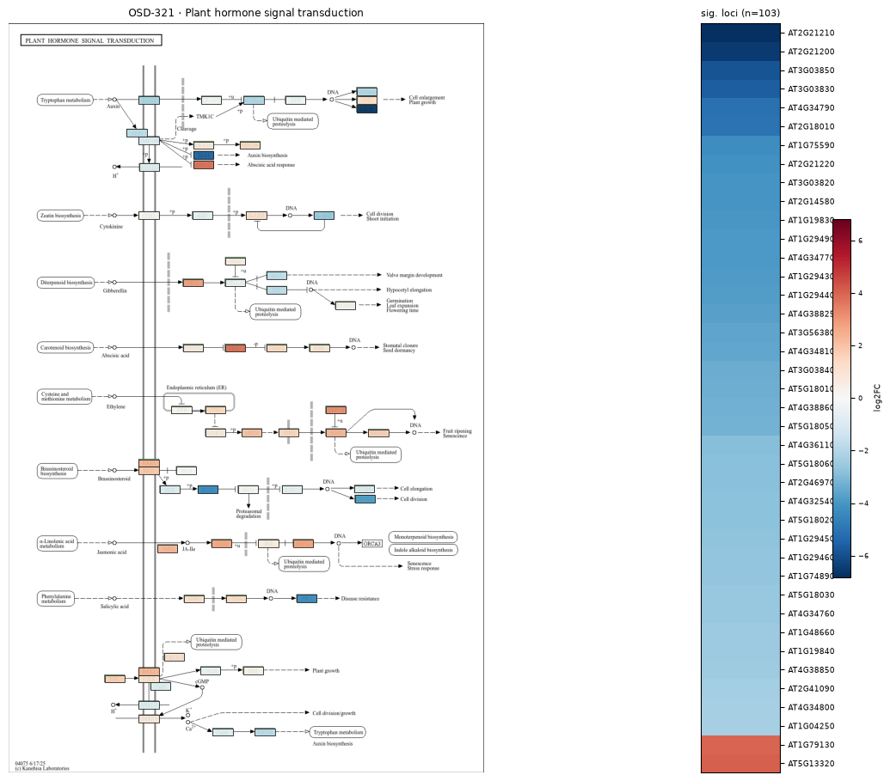

### ath00500 — Starch and sucrose metabolism  ·  55 significant genes

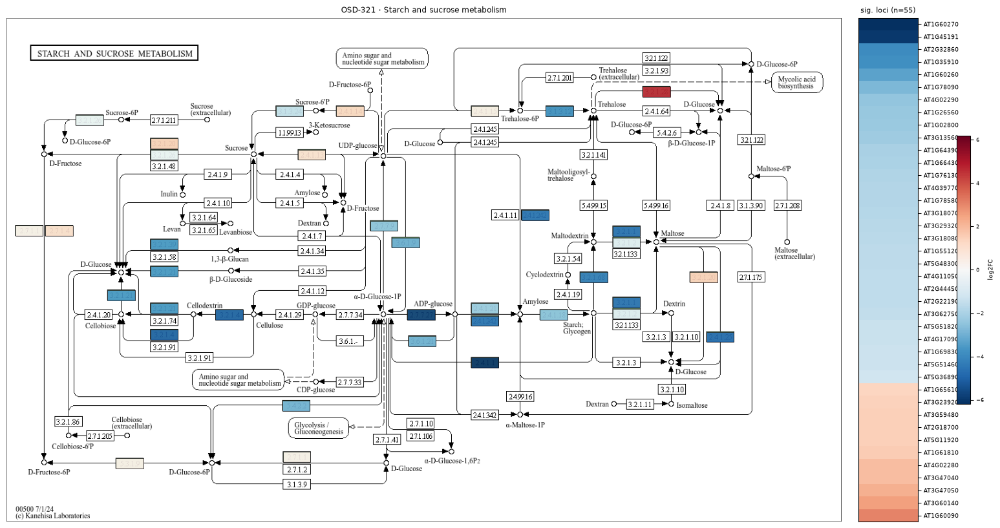

### ath04626 — Plant-pathogen interaction  ·  37 significant genes

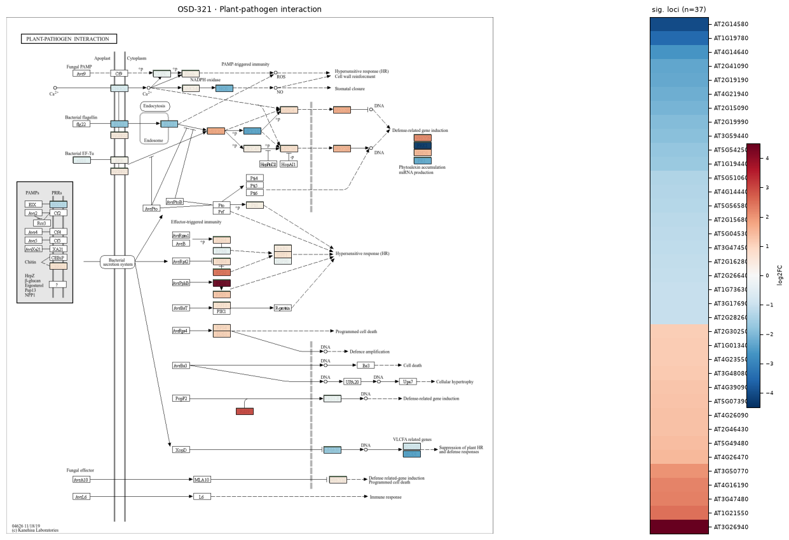

### ath00940 — Phenylpropanoid biosynthesis  ·  34 significant genes

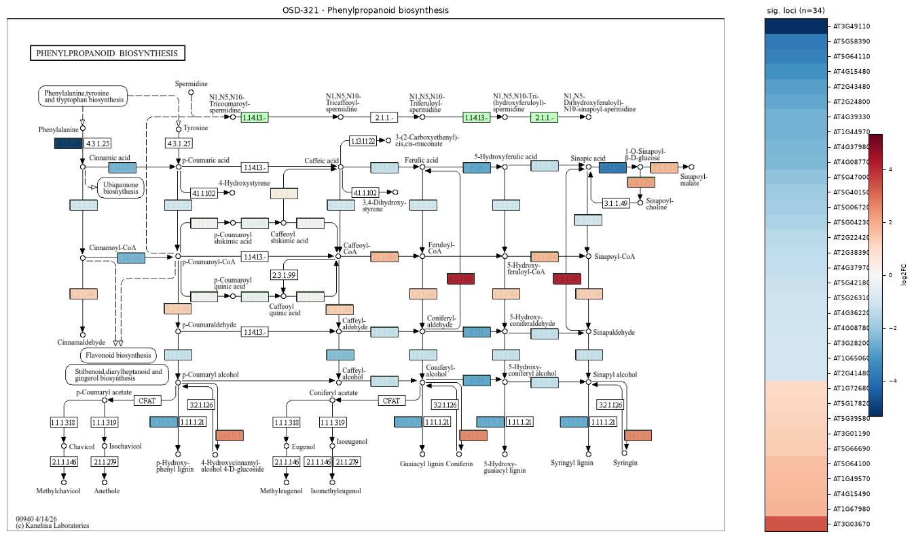

### ath00480 — Glutathione metabolism  ·  18 significant genes

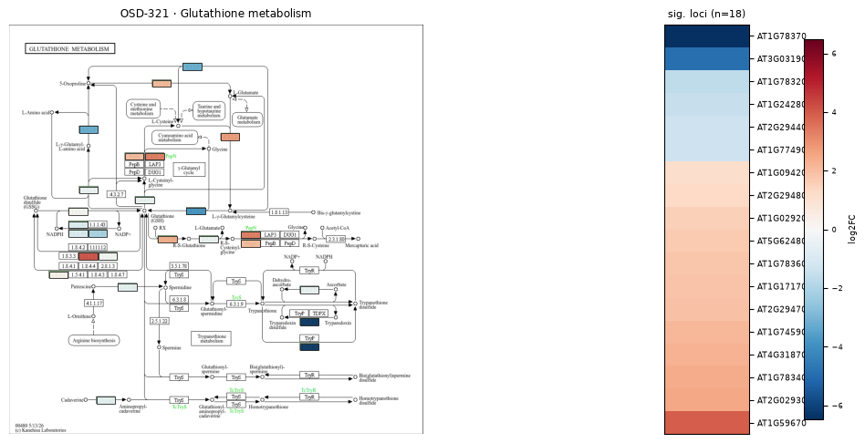

### ath00010 — Glycolysis / Gluconeogenesis  ·  17 significant genes

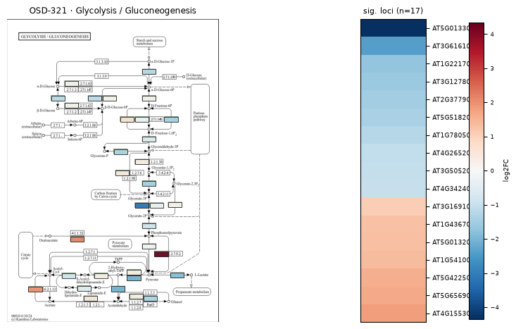

### ath00195 — Photosynthesis  ·  16 significant genes

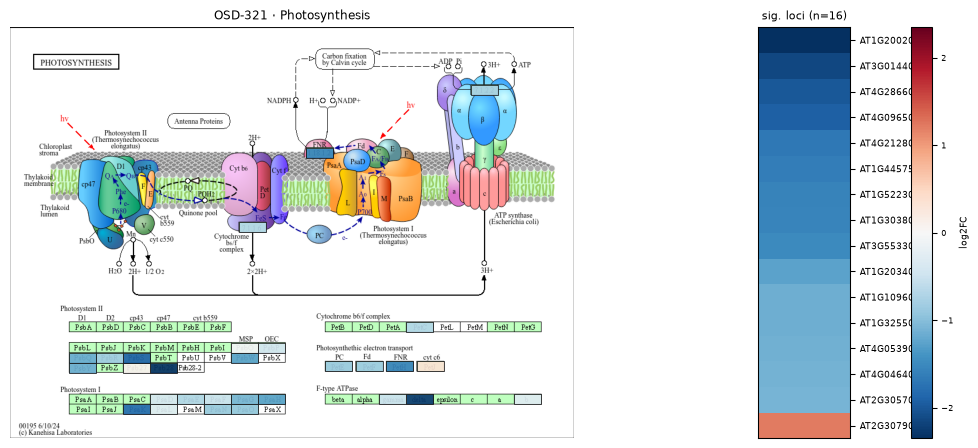

### ath00710 — Carbon fixation (Calvin cycle)  ·  14 significant genes

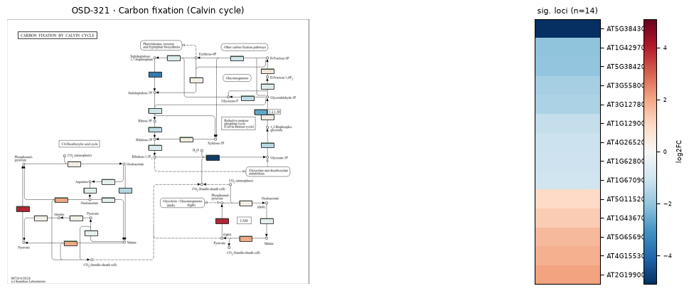

### ath00360 — Phenylalanine metabolism  ·  9 significant genes

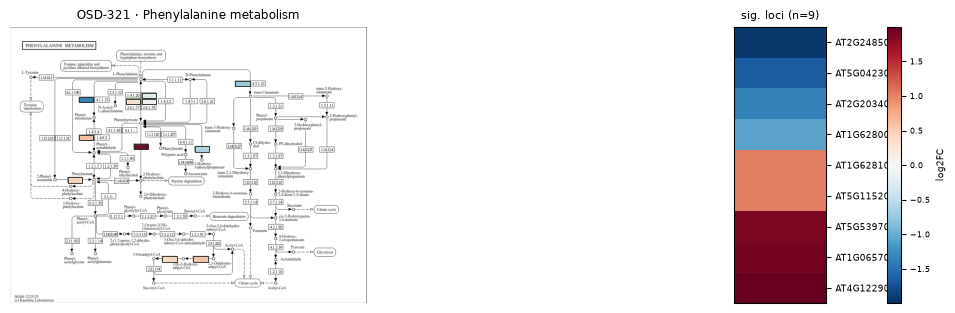

### ath00592 — alpha-Linolenic acid (jasmonate) metabolism  ·  8 significant genes

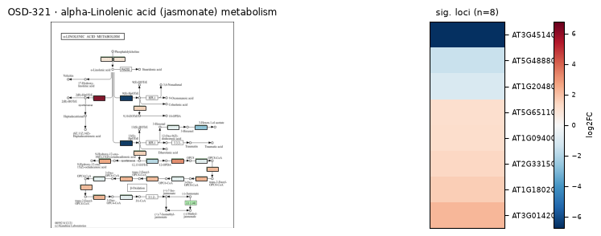

### ath00196 — Photosynthesis - antenna proteins  ·  7 significant genes

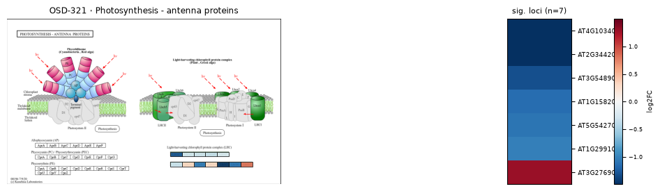

### ath00908 — Zeatin biosynthesis  ·  6 significant genes

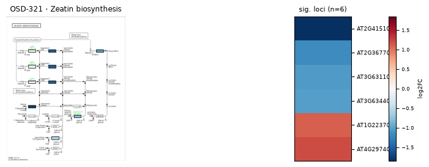

### ath04712 — Circadian rhythm - plant  ·  6 significant genes

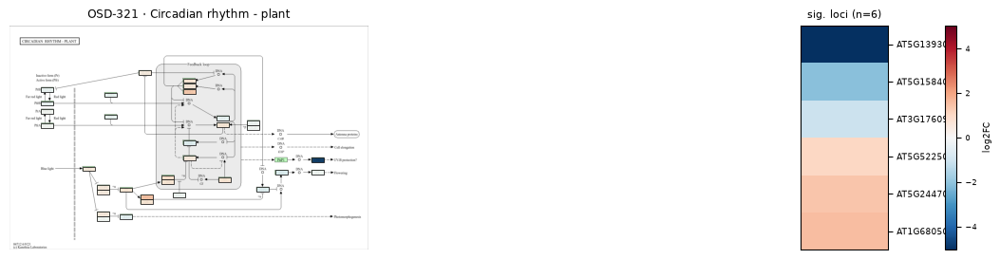

### ath00941 — Flavonoid biosynthesis  ·  4 significant genes

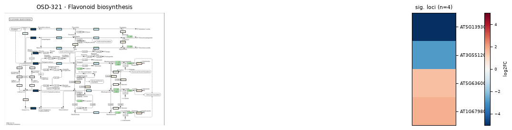
