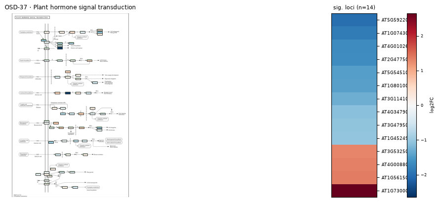
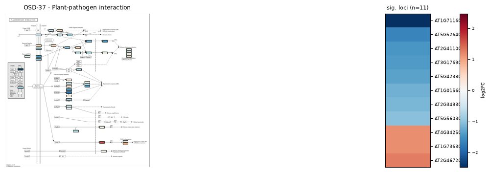
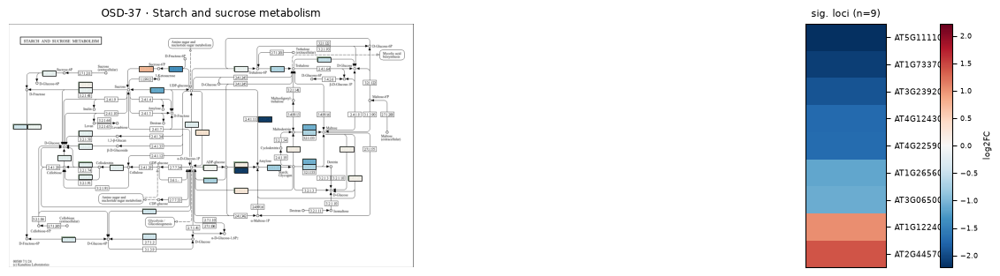
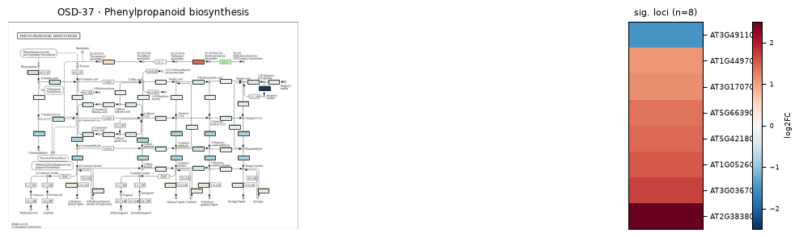
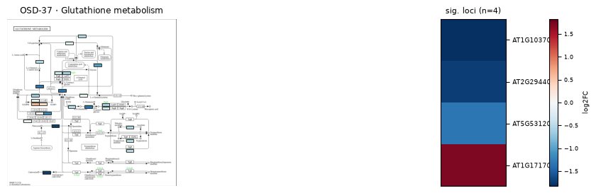
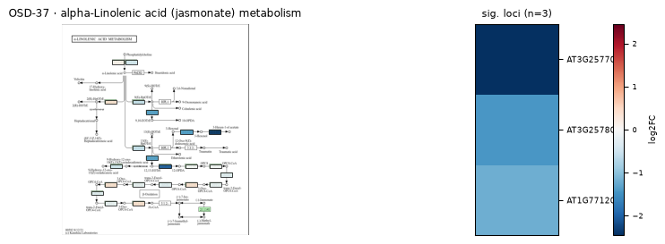

# OSD-37

**Comparison of the spaceflight transcriptome of four commonly used Arabidopsis thaliana ecotypes**

- Organism: *Arabidopsis thaliana*
- Contrast: `(Ground Control & Col-0)v(Space Flight & Col-0)`
- [Study on OSDR](https://osdr.nasa.gov/bio/repo/data/studies/OSD-37)
- [Open in the interactive viewer](https://dr-richard-barker.github.io/SBGN-Pathway-viewer/app/) — Import from OSDR → Curated → OSD-37

## Pathway projection

| KEGG | Pathway | genes | mapped | cov % | up | down | sig | mean|log2FC| |
| --- | --- | --- | --- | --- | --- | --- | --- | --- |
| ath00010 | Glycolysis / Gluconeogenesis | 161 | 117 | 72.7 | 1 | 4 | 2 | 0.253 |
| ath00195 | Photosynthesis | 85 | 46 | 54.1 | 0 | 1 | 0 | 0.228 |
| ath00196 | Photosynthesis - antenna proteins | 52 | 21 | 40.4 | 0 | 0 | 0 | 0.217 |
| ath00710 | Carbon fixation (Calvin cycle) | 72 | 69 | 95.8 | 0 | 1 | 0 | 0.211 |
| ath00500 | Starch and sucrose metabolism | 237 | 159 | 67.1 | 4 | 13 | 9 | 0.393 |
| ath00940 | Phenylpropanoid biosynthesis | 144 | 122 | 84.7 | 9 | 8 | 8 | 0.509 |
| ath00941 | Flavonoid biosynthesis | 39 | 21 | 53.8 | 2 | 0 | 0 | 0.515 |
| ath00592 | alpha-Linolenic acid (jasmonate) metabolism | 48 | 43 | 89.6 | 2 | 5 | 3 | 0.488 |
| ath00908 | Zeatin biosynthesis | 35 | 28 | 80.0 | 0 | 3 | 0 | 0.495 |
| ath04075 | Plant hormone signal transduction | 434 | 393 | 90.6 | 5 | 21 | 14 | 0.357 |
| ath04626 | Plant-pathogen interaction | 258 | 204 | 79.1 | 4 | 18 | 11 | 0.44 |
| ath04712 | Circadian rhythm - plant | 43 | 43 | 100.0 | 0 | 2 | 2 | 0.321 |
| ath00480 | Glutathione metabolism | 122 | 99 | 81.1 | 1 | 6 | 4 | 0.4 |
| ath00360 | Phenylalanine metabolism | 91 | 31 | 34.1 | 0 | 1 | 0 | 0.238 |

## Static pathway projections

Each panel: the study's data projected onto the KEGG pathway (left; red = up, blue = down) beside a heatmap of that pathway's significant loci (right, log2FC).

### ath04075 — Plant hormone signal transduction  ·  14 significant genes

### ath04626 — Plant-pathogen interaction  ·  11 significant genes

### ath00500 — Starch and sucrose metabolism  ·  9 significant genes

### ath00940 — Phenylpropanoid biosynthesis  ·  8 significant genes

### ath00480 — Glutathione metabolism  ·  4 significant genes

### ath00592 — alpha-Linolenic acid (jasmonate) metabolism  ·  3 significant genes

