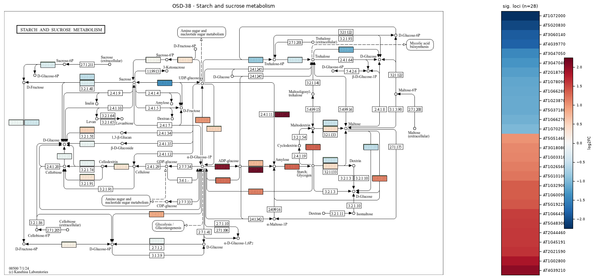
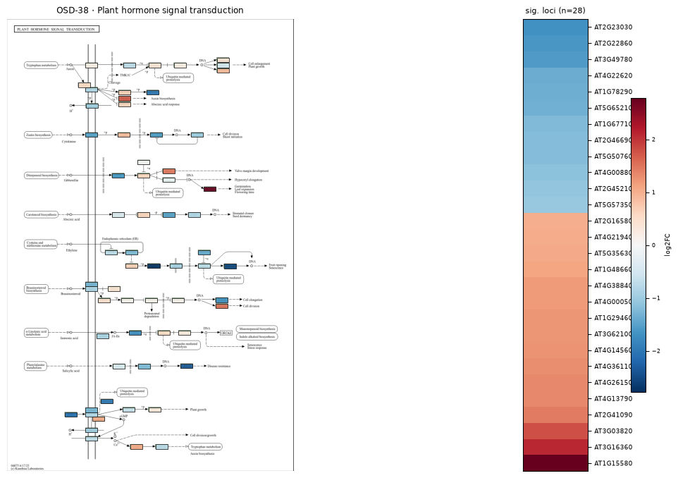
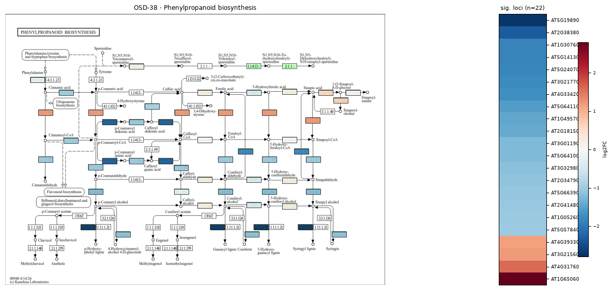
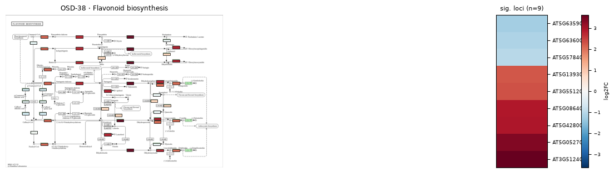
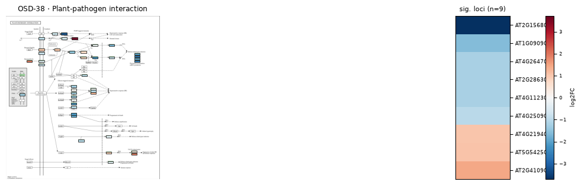
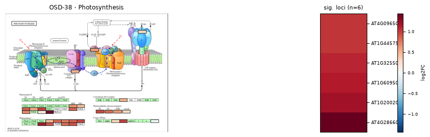
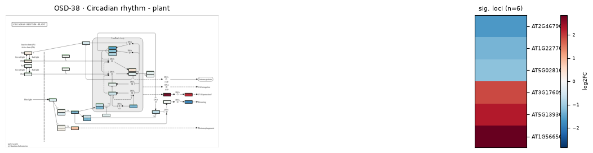
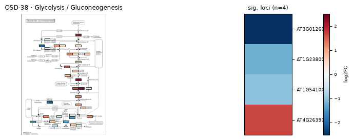
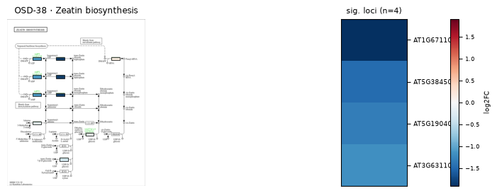
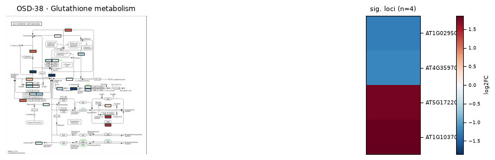

# OSD-38

**Proteomics and Transcriptomics analysis of Arabidopsis Seedlings in Microgravity**

- Organism: *Arabidopsis thaliana*
- Contrast: `(FLT)v(GC)`
- [Study on OSDR](https://osdr.nasa.gov/bio/repo/data/studies/OSD-38)
- [Open in the interactive viewer](https://dr-richard-barker.github.io/SBGN-Pathway-viewer/app/) — Import from OSDR → Curated → OSD-38

## Pathway projection

| KEGG | Pathway | genes | mapped | cov % | up | down | sig | mean|log2FC| |
| --- | --- | --- | --- | --- | --- | --- | --- | --- |
| ath00010 | Glycolysis / Gluconeogenesis | 161 | 116 | 72.0 | 2 | 3 | 4 | 0.369 |
| ath00195 | Photosynthesis | 85 | 46 | 54.1 | 13 | 0 | 6 | 0.76 |
| ath00196 | Photosynthesis - antenna proteins | 52 | 21 | 40.4 | 1 | 0 | 1 | 0.456 |
| ath00710 | Carbon fixation (Calvin cycle) | 72 | 69 | 95.8 | 0 | 0 | 0 | 0.396 |
| ath00500 | Starch and sucrose metabolism | 237 | 156 | 65.8 | 17 | 20 | 28 | 0.669 |
| ath00940 | Phenylpropanoid biosynthesis | 144 | 114 | 79.2 | 4 | 30 | 22 | 0.751 |
| ath00941 | Flavonoid biosynthesis | 39 | 19 | 48.7 | 7 | 3 | 9 | 1.399 |
| ath00592 | alpha-Linolenic acid (jasmonate) metabolism | 48 | 44 | 91.7 | 4 | 3 | 2 | 0.554 |
| ath00908 | Zeatin biosynthesis | 35 | 31 | 88.6 | 0 | 6 | 4 | 0.572 |
| ath04075 | Plant hormone signal transduction | 434 | 390 | 89.9 | 24 | 22 | 28 | 0.48 |
| ath04626 | Plant-pathogen interaction | 258 | 200 | 77.5 | 5 | 14 | 9 | 0.456 |
| ath04712 | Circadian rhythm - plant | 43 | 42 | 97.7 | 3 | 4 | 6 | 0.563 |
| ath00480 | Glutathione metabolism | 122 | 92 | 75.4 | 2 | 7 | 4 | 0.432 |
| ath00360 | Phenylalanine metabolism | 91 | 31 | 34.1 | 1 | 3 | 2 | 0.533 |

## Static pathway projections

Each panel: the study's data projected onto the KEGG pathway (left; red = up, blue = down) beside a heatmap of that pathway's significant loci (right, log2FC).

### ath00500 — Starch and sucrose metabolism  ·  28 significant genes

### ath04075 — Plant hormone signal transduction  ·  28 significant genes

### ath00940 — Phenylpropanoid biosynthesis  ·  22 significant genes

### ath00941 — Flavonoid biosynthesis  ·  9 significant genes

### ath04626 — Plant-pathogen interaction  ·  9 significant genes

### ath00195 — Photosynthesis  ·  6 significant genes

### ath04712 — Circadian rhythm - plant  ·  6 significant genes

### ath00010 — Glycolysis / Gluconeogenesis  ·  4 significant genes

### ath00908 — Zeatin biosynthesis  ·  4 significant genes

### ath00480 — Glutathione metabolism  ·  4 significant genes

