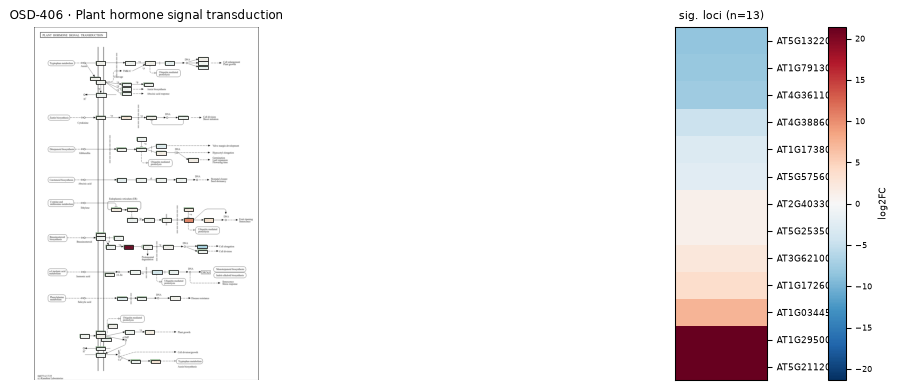
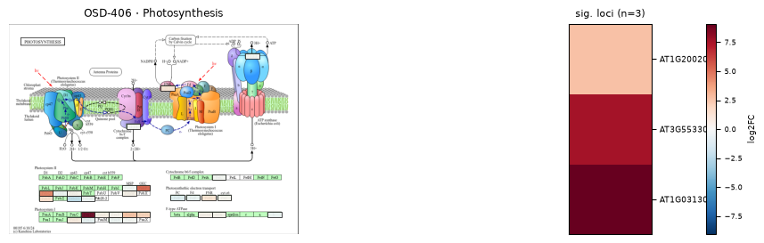
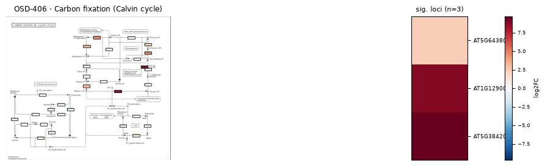

# OSD-406

**Transcriptomic responses of Arabidopsis thaliana lines WS and sku5 to the Blue Origin NS-12 and Virgin Galactic VP-03 suborbital flights**

- Organism: *Arabidopsis thaliana*
- Contrast: `(Col-0 & Wild Type & Ground Control & Virgin Galactic SpaceShipTwo)v(Col-0 & Wild Type & Suborbital Flight & Virgin Galactic SpaceShipTwo)`
- [Study on OSDR](https://osdr.nasa.gov/bio/repo/data/studies/OSD-406)
- [Open in the interactive viewer](https://dr-richard-barker.github.io/SBGN-Pathway-viewer/app/) — Import from OSDR → Curated → OSD-406

## Pathway projection

| KEGG | Pathway | genes | mapped | cov % | up | down | sig | mean|log2FC| |
| --- | --- | --- | --- | --- | --- | --- | --- | --- |
| ath00010 | Glycolysis / Gluconeogenesis | 161 | 116 | 72.0 | 6 | 0 | 1 | 0.409 |
| ath00195 | Photosynthesis | 85 | 45 | 52.9 | 8 | 2 | 3 | 1.028 |
| ath00196 | Photosynthesis - antenna proteins | 52 | 21 | 40.4 | 1 | 2 | 1 | 1.006 |
| ath00710 | Carbon fixation (Calvin cycle) | 72 | 70 | 97.2 | 10 | 0 | 3 | 0.721 |
| ath00500 | Starch and sucrose metabolism | 237 | 159 | 67.1 | 10 | 10 | 2 | 0.621 |
| ath00940 | Phenylpropanoid biosynthesis | 144 | 119 | 82.6 | 8 | 8 | 2 | 0.667 |
| ath00941 | Flavonoid biosynthesis | 39 | 21 | 53.8 | 1 | 4 | 1 | 1.069 |
| ath00592 | alpha-Linolenic acid (jasmonate) metabolism | 48 | 40 | 83.3 | 1 | 2 | 0 | 0.437 |
| ath00908 | Zeatin biosynthesis | 35 | 27 | 77.1 | 3 | 3 | 0 | 1.017 |
| ath04075 | Plant hormone signal transduction | 434 | 369 | 85.0 | 26 | 23 | 13 | 0.774 |
| ath04626 | Plant-pathogen interaction | 258 | 195 | 75.6 | 11 | 13 | 2 | 0.598 |
| ath04712 | Circadian rhythm - plant | 43 | 42 | 97.7 | 2 | 2 | 0 | 0.439 |
| ath00480 | Glutathione metabolism | 122 | 100 | 82.0 | 5 | 0 | 0 | 0.306 |
| ath00360 | Phenylalanine metabolism | 91 | 32 | 35.2 | 3 | 0 | 0 | 0.347 |

## Static pathway projections

Each panel: the study's data projected onto the KEGG pathway (left; red = up, blue = down) beside a heatmap of that pathway's significant loci (right, log2FC).

### ath04075 — Plant hormone signal transduction  ·  13 significant genes

### ath00195 — Photosynthesis  ·  3 significant genes

### ath00710 — Carbon fixation (Calvin cycle)  ·  3 significant genes

