# OSD-437

**Transcriptional and Post transcriptional Regulation of Seedling Development in Microgravity**

- Organism: *Arabidopsis thaliana*
- Contrast: `(4 day & 1G by centrifugation & Space Flight)v(6 day & 1G on Earth & Ground Control)`
- [Study on OSDR](https://osdr.nasa.gov/bio/repo/data/studies/OSD-437)
- [Open in the interactive viewer](https://dr-richard-barker.github.io/SBGN-Pathway-viewer/app/) — Import from OSDR → Curated → OSD-437

## Pathway projection

| KEGG | Pathway | genes | mapped | cov % | up | down | sig | mean|log2FC| |
| --- | --- | --- | --- | --- | --- | --- | --- | --- |
| ath00010 | Glycolysis / Gluconeogenesis | 161 | 113 | 70.2 | 10 | 3 | 10 | 0.494 |
| ath00195 | Photosynthesis | 85 | 45 | 52.9 | 9 | 1 | 10 | 0.661 |
| ath00196 | Photosynthesis - antenna proteins | 52 | 22 | 42.3 | 2 | 0 | 2 | 0.736 |
| ath00710 | Carbon fixation (Calvin cycle) | 72 | 68 | 94.4 | 7 | 1 | 4 | 0.506 |
| ath00500 | Starch and sucrose metabolism | 237 | 150 | 63.3 | 21 | 18 | 27 | 0.856 |
| ath00940 | Phenylpropanoid biosynthesis | 144 | 111 | 77.1 | 34 | 13 | 24 | 1.215 |
| ath00941 | Flavonoid biosynthesis | 39 | 20 | 51.3 | 4 | 2 | 2 | 0.905 |
| ath00592 | alpha-Linolenic acid (jasmonate) metabolism | 48 | 44 | 91.7 | 8 | 6 | 10 | 0.988 |
| ath00908 | Zeatin biosynthesis | 35 | 25 | 71.4 | 7 | 2 | 6 | 1.124 |
| ath04075 | Plant hormone signal transduction | 434 | 377 | 86.9 | 90 | 24 | 84 | 0.909 |
| ath04626 | Plant-pathogen interaction | 258 | 182 | 70.5 | 44 | 8 | 41 | 0.849 |
| ath04712 | Circadian rhythm - plant | 43 | 41 | 95.3 | 5 | 4 | 8 | 0.762 |
| ath00480 | Glutathione metabolism | 122 | 95 | 77.9 | 9 | 7 | 10 | 0.638 |
| ath00360 | Phenylalanine metabolism | 91 | 28 | 30.8 | 6 | 2 | 5 | 0.725 |

## Static pathway projections

Each panel: the study's data projected onto the KEGG pathway (left; red = up, blue = down) beside a heatmap of that pathway's significant loci (right, log2FC).

### ath04075 — Plant hormone signal transduction  ·  84 significant genes

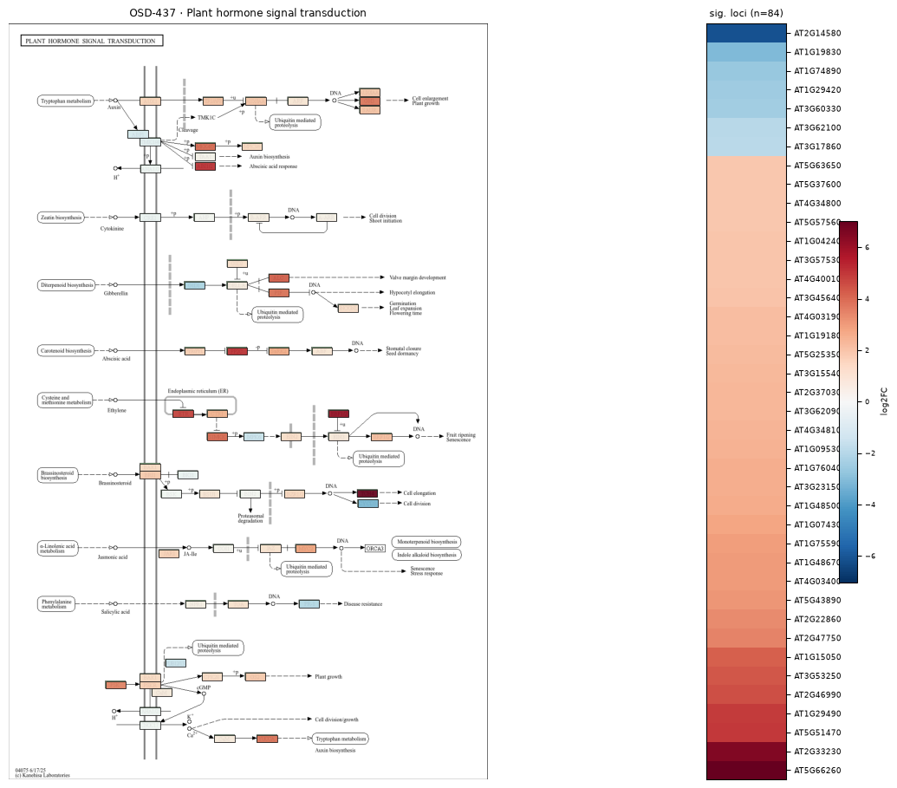

### ath04626 — Plant-pathogen interaction  ·  41 significant genes

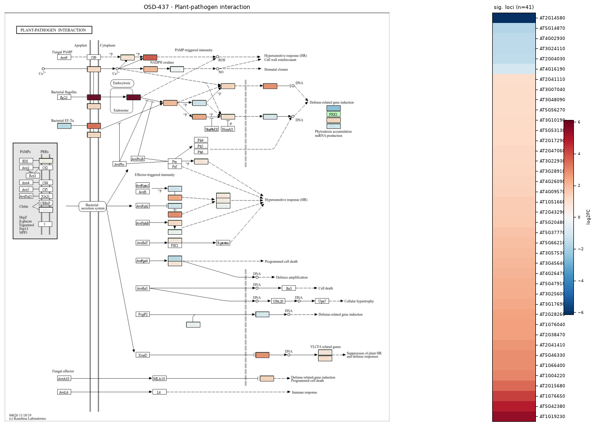

### ath00500 — Starch and sucrose metabolism  ·  27 significant genes

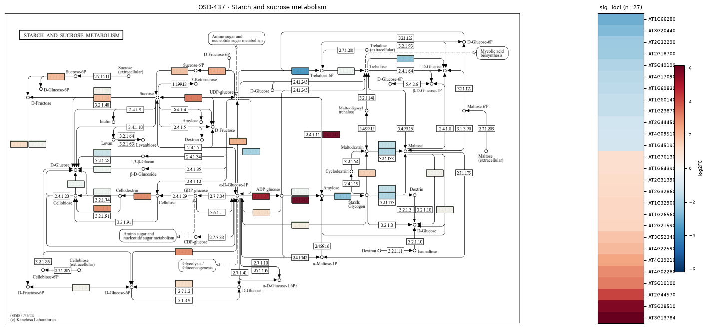

### ath00940 — Phenylpropanoid biosynthesis  ·  24 significant genes

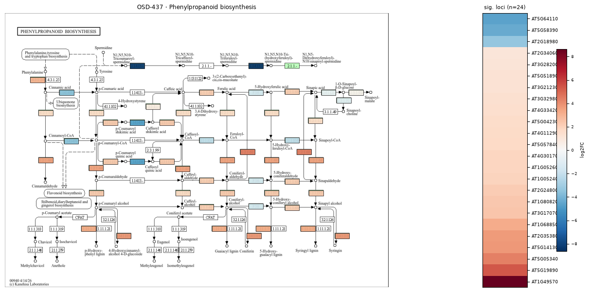

### ath00010 — Glycolysis / Gluconeogenesis  ·  10 significant genes

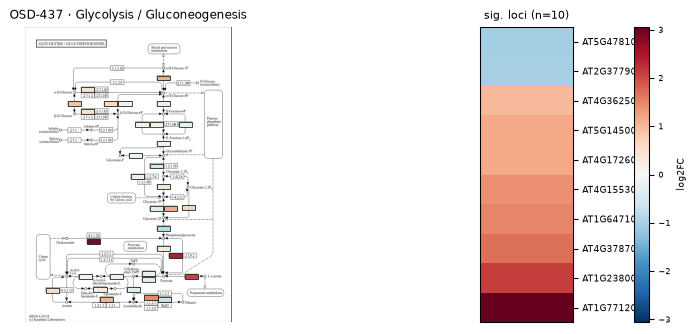

### ath00195 — Photosynthesis  ·  10 significant genes

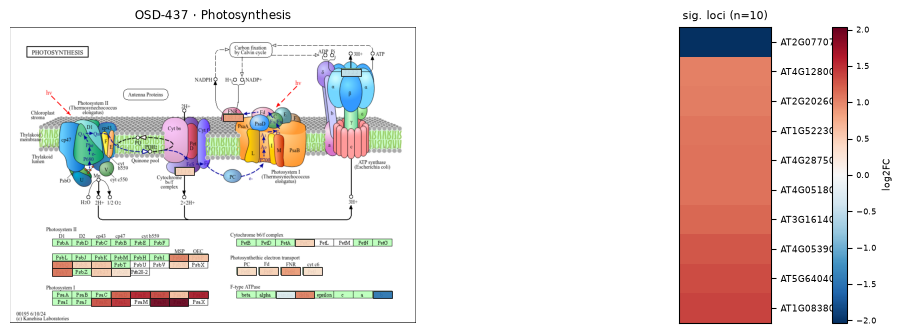

### ath00592 — alpha-Linolenic acid (jasmonate) metabolism  ·  10 significant genes

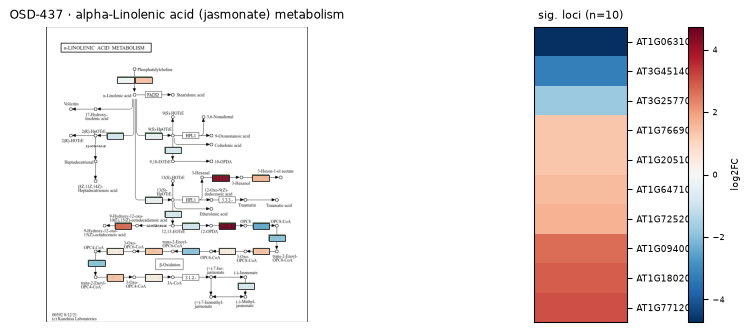

### ath00480 — Glutathione metabolism  ·  10 significant genes

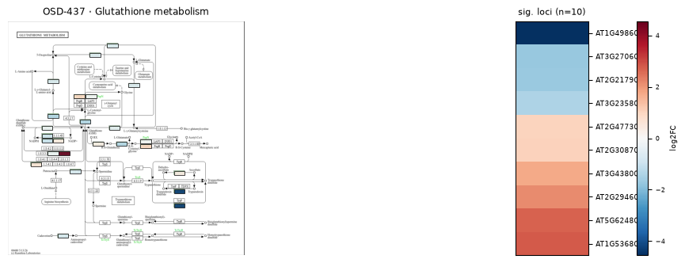

### ath04712 — Circadian rhythm - plant  ·  8 significant genes

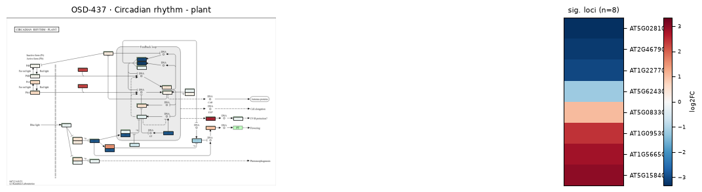

### ath00908 — Zeatin biosynthesis  ·  6 significant genes

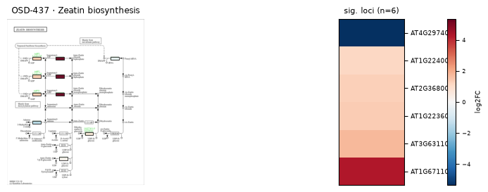

### ath00360 — Phenylalanine metabolism  ·  5 significant genes

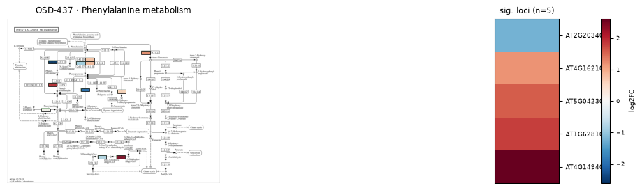

### ath00710 — Carbon fixation (Calvin cycle)  ·  4 significant genes

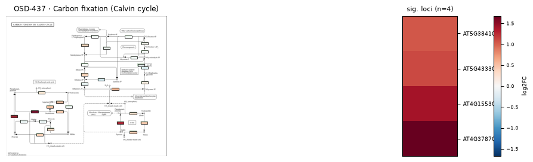
