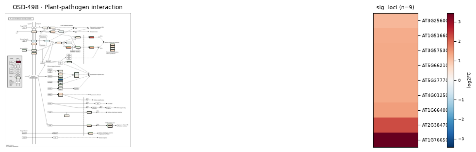
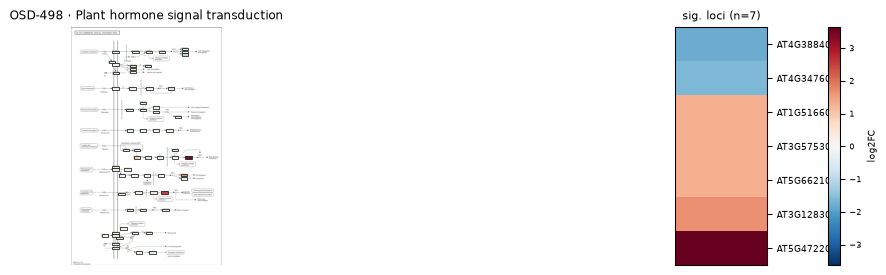

# OSD-498

**The SOG1 transcriptional activator and the MYB3R family of repressors control a complex gene network in response to DNA damage in Arabidopsis [RNA-seq gIR vs mock wt]**

- Organism: *Arabidopsis thaliana*
- Contrast: `(10 minute & Cobalt-60 gamma radiation)v(10 minute & non-irradiated)`
- [Study on OSDR](https://osdr.nasa.gov/bio/repo/data/studies/OSD-498)
- [Open in the interactive viewer](https://dr-richard-barker.github.io/SBGN-Pathway-viewer/app/) — Import from OSDR → Curated → OSD-498

## Pathway projection

| KEGG | Pathway | genes | mapped | cov % | up | down | sig | mean|log2FC| |
| --- | --- | --- | --- | --- | --- | --- | --- | --- |
| ath00010 | Glycolysis / Gluconeogenesis | 161 | 114 | 70.8 | 1 | 0 | 0 | 0.153 |
| ath00195 | Photosynthesis | 85 | 45 | 52.9 | 1 | 1 | 0 | 0.236 |
| ath00196 | Photosynthesis - antenna proteins | 52 | 22 | 42.3 | 0 | 0 | 0 | 0.502 |
| ath00710 | Carbon fixation (Calvin cycle) | 72 | 69 | 95.8 | 1 | 0 | 0 | 0.142 |
| ath00500 | Starch and sucrose metabolism | 237 | 150 | 63.3 | 4 | 1 | 0 | 0.264 |
| ath00940 | Phenylpropanoid biosynthesis | 144 | 110 | 76.4 | 4 | 0 | 0 | 0.277 |
| ath00941 | Flavonoid biosynthesis | 39 | 18 | 46.2 | 0 | 0 | 0 | 0.137 |
| ath00592 | alpha-Linolenic acid (jasmonate) metabolism | 48 | 42 | 87.5 | 3 | 1 | 0 | 0.449 |
| ath00908 | Zeatin biosynthesis | 35 | 26 | 74.3 | 2 | 0 | 0 | 0.38 |
| ath04075 | Plant hormone signal transduction | 434 | 363 | 83.6 | 13 | 31 | 7 | 0.435 |
| ath04626 | Plant-pathogen interaction | 258 | 187 | 72.5 | 18 | 2 | 9 | 0.372 |
| ath04712 | Circadian rhythm - plant | 43 | 42 | 97.7 | 0 | 0 | 0 | 0.257 |
| ath00480 | Glutathione metabolism | 122 | 93 | 76.2 | 2 | 2 | 0 | 0.254 |
| ath00360 | Phenylalanine metabolism | 91 | 29 | 31.9 | 0 | 1 | 0 | 0.185 |

## Static pathway projections

Each panel: the study's data projected onto the KEGG pathway (left; red = up, blue = down) beside a heatmap of that pathway's significant loci (right, log2FC).

### ath04626 — Plant-pathogen interaction  ·  9 significant genes

### ath04075 — Plant hormone signal transduction  ·  7 significant genes

