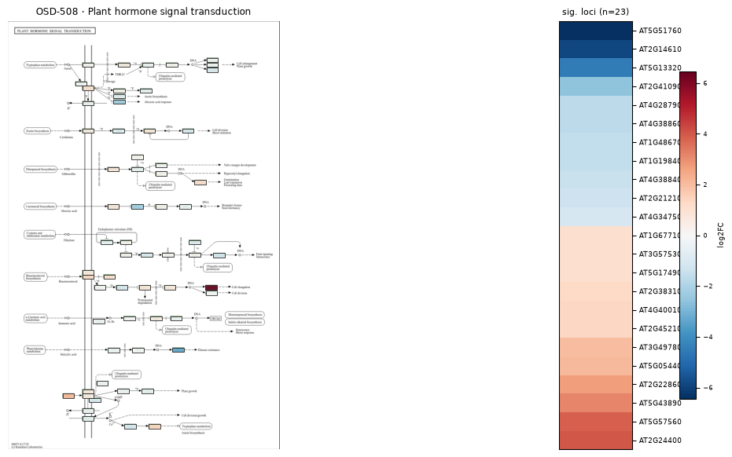
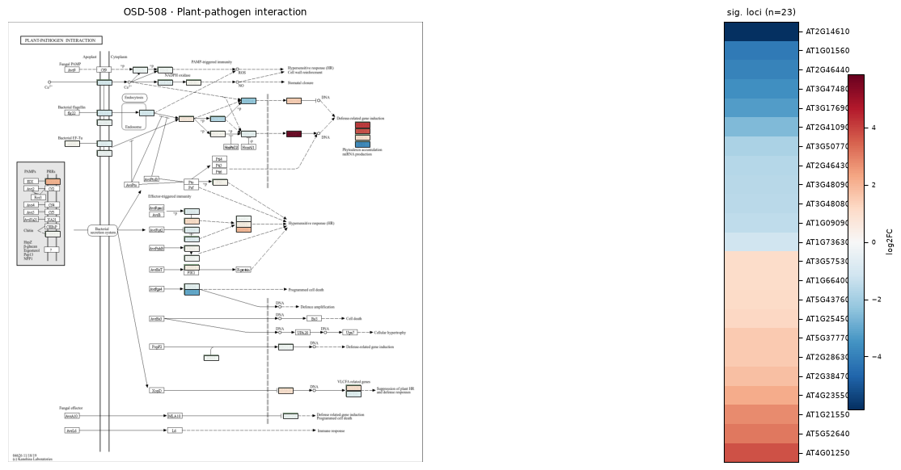
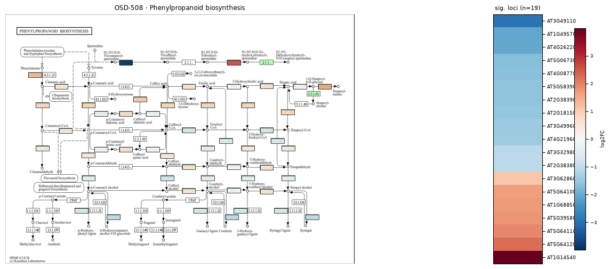
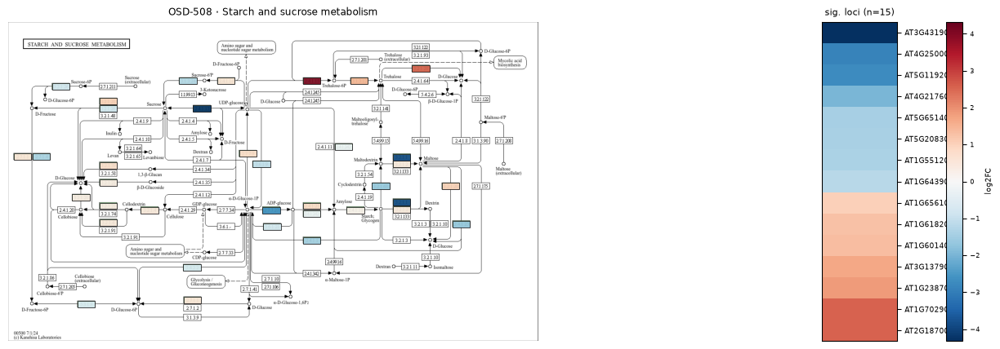
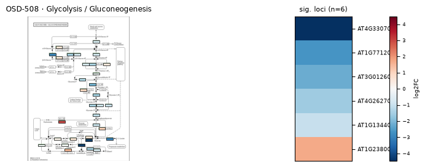
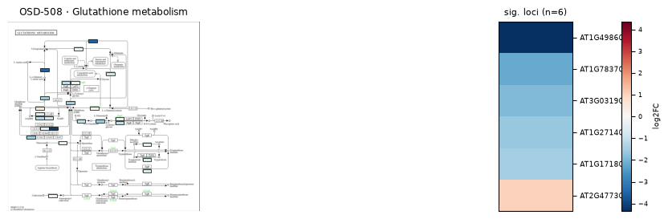
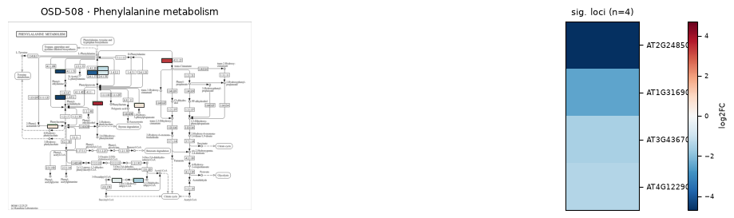
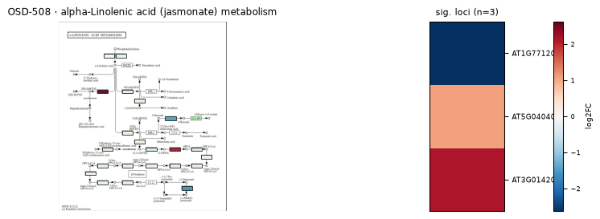

# OSD-508

**The SOG1 transcriptional activator and the MYB3R family of repressors control a complex gene network in response to DNA damage in Arabidopsis [RNA-seq t vs t0]**

- Organism: *Arabidopsis thaliana*
- Contrast: `(sog1-1 & Cobalt-60 gamma radiation & 10 minute)v(sog1-1 & Cobalt-60 gamma radiation & 1440 minute)`
- [Study on OSDR](https://osdr.nasa.gov/bio/repo/data/studies/OSD-508)
- [Open in the interactive viewer](https://dr-richard-barker.github.io/SBGN-Pathway-viewer/app/) — Import from OSDR → Curated → OSD-508

## Pathway projection

| KEGG | Pathway | genes | mapped | cov % | up | down | sig | mean|log2FC| |
| --- | --- | --- | --- | --- | --- | --- | --- | --- |
| ath00010 | Glycolysis / Gluconeogenesis | 161 | 114 | 70.8 | 2 | 7 | 6 | 0.445 |
| ath00195 | Photosynthesis | 85 | 45 | 52.9 | 0 | 2 | 1 | 0.409 |
| ath00196 | Photosynthesis - antenna proteins | 52 | 22 | 42.3 | 0 | 0 | 0 | 0.29 |
| ath00710 | Carbon fixation (Calvin cycle) | 72 | 69 | 95.8 | 1 | 1 | 1 | 0.324 |
| ath00500 | Starch and sucrose metabolism | 237 | 155 | 65.4 | 13 | 14 | 15 | 0.609 |
| ath00940 | Phenylpropanoid biosynthesis | 144 | 117 | 81.2 | 11 | 20 | 19 | 0.757 |
| ath00941 | Flavonoid biosynthesis | 39 | 20 | 51.3 | 2 | 2 | 2 | 0.743 |
| ath00592 | alpha-Linolenic acid (jasmonate) metabolism | 48 | 43 | 89.6 | 4 | 3 | 3 | 0.641 |
| ath00908 | Zeatin biosynthesis | 35 | 28 | 80.0 | 4 | 3 | 0 | 0.669 |
| ath04075 | Plant hormone signal transduction | 434 | 375 | 86.4 | 25 | 42 | 23 | 0.609 |
| ath04626 | Plant-pathogen interaction | 258 | 192 | 74.4 | 17 | 21 | 23 | 0.679 |
| ath04712 | Circadian rhythm - plant | 43 | 43 | 100.0 | 1 | 4 | 2 | 0.53 |
| ath00480 | Glutathione metabolism | 122 | 97 | 79.5 | 4 | 8 | 6 | 0.572 |
| ath00360 | Phenylalanine metabolism | 91 | 30 | 33.0 | 0 | 4 | 4 | 0.692 |

## Static pathway projections

Each panel: the study's data projected onto the KEGG pathway (left; red = up, blue = down) beside a heatmap of that pathway's significant loci (right, log2FC).

### ath04075 — Plant hormone signal transduction  ·  23 significant genes

### ath04626 — Plant-pathogen interaction  ·  23 significant genes

### ath00940 — Phenylpropanoid biosynthesis  ·  19 significant genes

### ath00500 — Starch and sucrose metabolism  ·  15 significant genes

### ath00010 — Glycolysis / Gluconeogenesis  ·  6 significant genes

### ath00480 — Glutathione metabolism  ·  6 significant genes

### ath00360 — Phenylalanine metabolism  ·  4 significant genes

### ath00592 — alpha-Linolenic acid (jasmonate) metabolism  ·  3 significant genes

