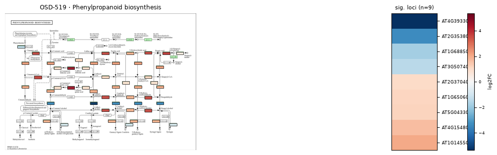
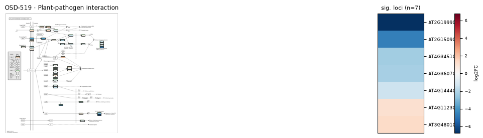
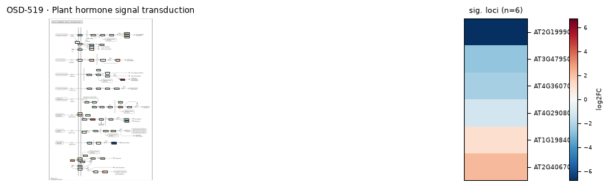
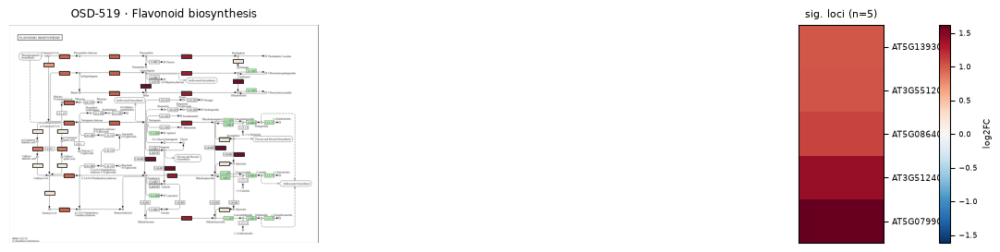
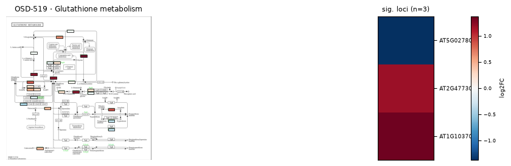

# OSD-519

**PUCHI represses early meristem formation in developing lateral roots of Arabidopsis thaliana**

- Organism: *Arabidopsis thaliana*
- Contrast: `(puchi-1 mutant & Lateral root and surrounding tissues at the bend & vertical rotation & 12 hour)v(puchi-1 mutant & Lateral root and surrounding tissues at the bend & vertical rotation & 18 hour)`
- [Study on OSDR](https://osdr.nasa.gov/bio/repo/data/studies/OSD-519)
- [Open in the interactive viewer](https://dr-richard-barker.github.io/SBGN-Pathway-viewer/app/) — Import from OSDR → Curated → OSD-519

## Pathway projection

| KEGG | Pathway | genes | mapped | cov % | up | down | sig | mean|log2FC| |
| --- | --- | --- | --- | --- | --- | --- | --- | --- |
| ath00010 | Glycolysis / Gluconeogenesis | 161 | 113 | 70.2 | 4 | 0 | 0 | 0.284 |
| ath00195 | Photosynthesis | 85 | 43 | 50.6 | 1 | 1 | 0 | 0.398 |
| ath00196 | Photosynthesis - antenna proteins | 52 | 18 | 34.6 | 0 | 2 | 0 | 0.52 |
| ath00710 | Carbon fixation (Calvin cycle) | 72 | 66 | 91.7 | 3 | 0 | 0 | 0.298 |
| ath00500 | Starch and sucrose metabolism | 237 | 155 | 65.4 | 11 | 5 | 1 | 0.448 |
| ath00940 | Phenylpropanoid biosynthesis | 144 | 111 | 77.1 | 24 | 12 | 9 | 0.943 |
| ath00941 | Flavonoid biosynthesis | 39 | 18 | 46.2 | 6 | 0 | 5 | 0.693 |
| ath00592 | alpha-Linolenic acid (jasmonate) metabolism | 48 | 39 | 81.2 | 3 | 1 | 1 | 0.434 |
| ath00908 | Zeatin biosynthesis | 35 | 22 | 62.9 | 0 | 2 | 1 | 0.473 |
| ath04075 | Plant hormone signal transduction | 434 | 343 | 79.0 | 19 | 9 | 6 | 0.39 |
| ath04626 | Plant-pathogen interaction | 258 | 188 | 72.9 | 15 | 7 | 7 | 0.487 |
| ath04712 | Circadian rhythm - plant | 43 | 41 | 95.3 | 1 | 2 | 1 | 0.372 |
| ath00480 | Glutathione metabolism | 122 | 96 | 78.7 | 4 | 4 | 3 | 0.408 |
| ath00360 | Phenylalanine metabolism | 91 | 31 | 34.1 | 2 | 1 | 1 | 0.464 |

## Static pathway projections

Each panel: the study's data projected onto the KEGG pathway (left; red = up, blue = down) beside a heatmap of that pathway's significant loci (right, log2FC).

### ath00940 — Phenylpropanoid biosynthesis  ·  9 significant genes

### ath04626 — Plant-pathogen interaction  ·  7 significant genes

### ath04075 — Plant hormone signal transduction  ·  6 significant genes

### ath00941 — Flavonoid biosynthesis  ·  5 significant genes

### ath00480 — Glutathione metabolism  ·  3 significant genes

