# OSD-782

**Multi-omics profiling reveals ethylene signalling as a key pathway underlying both genetic and epigenetic responses to low-dose ionizing radiation in Arabidopsis**

- Organism: *Arabidopsis thaliana*
- Contrast: `(cesium-137 gamma radiation & 10 centigray & 1 hour)v(cesium-137 gamma radiation & 10 centigray & 24 hour)`
- [Study on OSDR](https://osdr.nasa.gov/bio/repo/data/studies/OSD-782)
- [Open in the interactive viewer](https://dr-richard-barker.github.io/SBGN-Pathway-viewer/app/) — Import from OSDR → Curated → OSD-782

## Pathway projection

| KEGG | Pathway | genes | mapped | cov % | up | down | sig | mean|log2FC| |
| --- | --- | --- | --- | --- | --- | --- | --- | --- |
| ath00010 | Glycolysis / Gluconeogenesis | 161 | 115 | 71.4 | 5 | 4 | 5 | 0.415 |
| ath00195 | Photosynthesis | 85 | 45 | 52.9 | 0 | 0 | 0 | 0.303 |
| ath00196 | Photosynthesis - antenna proteins | 52 | 21 | 40.4 | 1 | 0 | 1 | 0.496 |
| ath00710 | Carbon fixation (Calvin cycle) | 72 | 69 | 95.8 | 4 | 1 | 4 | 0.345 |
| ath00500 | Starch and sucrose metabolism | 237 | 157 | 66.2 | 8 | 25 | 23 | 0.697 |
| ath00940 | Phenylpropanoid biosynthesis | 144 | 108 | 75.0 | 7 | 22 | 12 | 0.8 |
| ath00941 | Flavonoid biosynthesis | 39 | 21 | 53.8 | 1 | 8 | 6 | 1.033 |
| ath00592 | alpha-Linolenic acid (jasmonate) metabolism | 48 | 45 | 93.8 | 4 | 2 | 4 | 0.641 |
| ath00908 | Zeatin biosynthesis | 35 | 29 | 82.9 | 7 | 3 | 7 | 0.75 |
| ath04075 | Plant hormone signal transduction | 434 | 373 | 85.9 | 29 | 34 | 40 | 0.61 |
| ath04626 | Plant-pathogen interaction | 258 | 189 | 73.3 | 27 | 11 | 29 | 0.639 |
| ath04712 | Circadian rhythm - plant | 43 | 42 | 97.7 | 3 | 5 | 6 | 0.611 |
| ath00480 | Glutathione metabolism | 122 | 96 | 78.7 | 3 | 14 | 6 | 0.641 |
| ath00360 | Phenylalanine metabolism | 91 | 31 | 34.1 | 3 | 3 | 4 | 0.568 |

## Static pathway projections

Each panel: the study's data projected onto the KEGG pathway (left; red = up, blue = down) beside a heatmap of that pathway's significant loci (right, log2FC).

### ath04075 — Plant hormone signal transduction  ·  40 significant genes

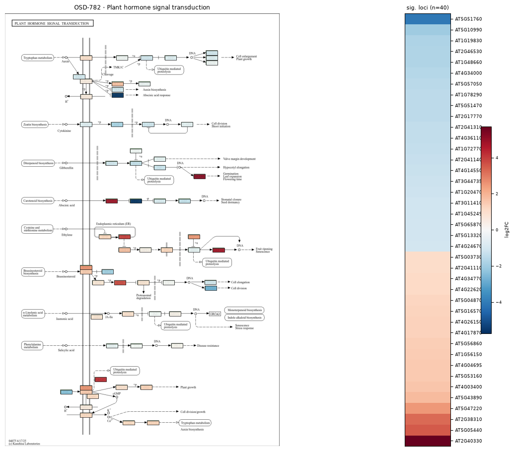

### ath04626 — Plant-pathogen interaction  ·  29 significant genes

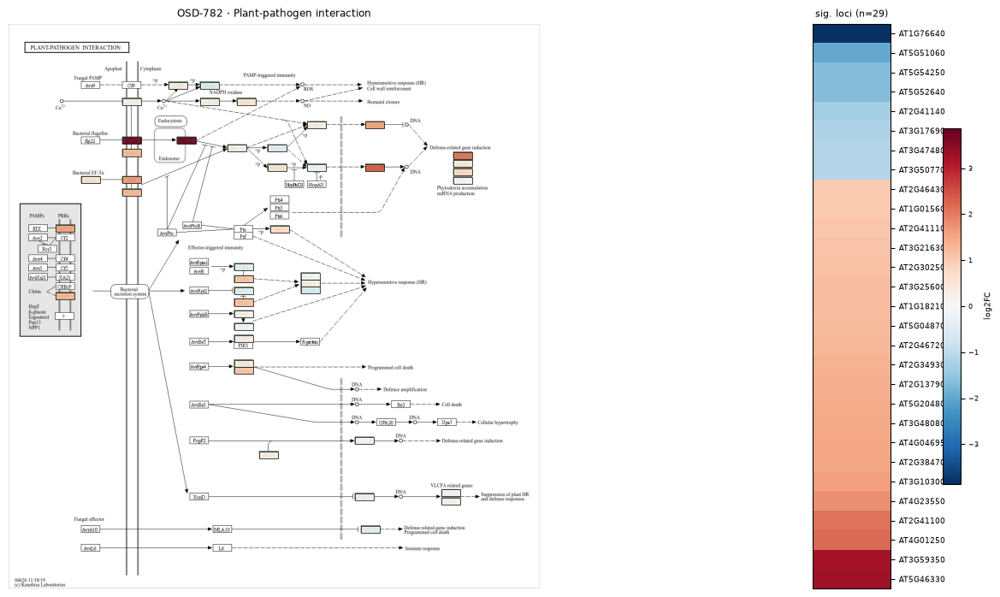

### ath00500 — Starch and sucrose metabolism  ·  23 significant genes

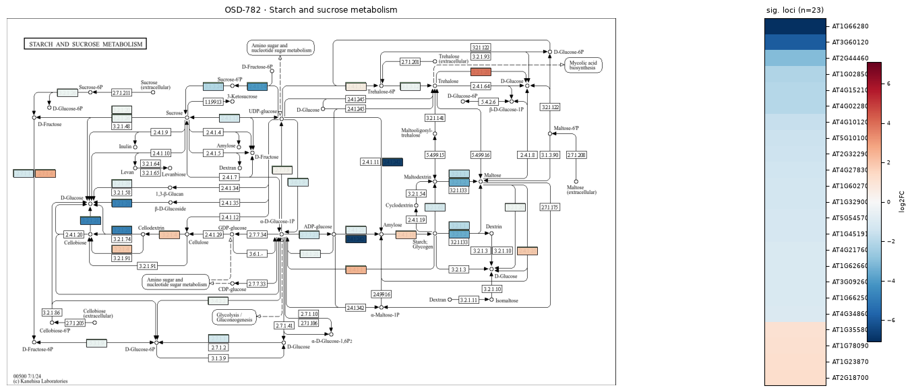

### ath00940 — Phenylpropanoid biosynthesis  ·  12 significant genes

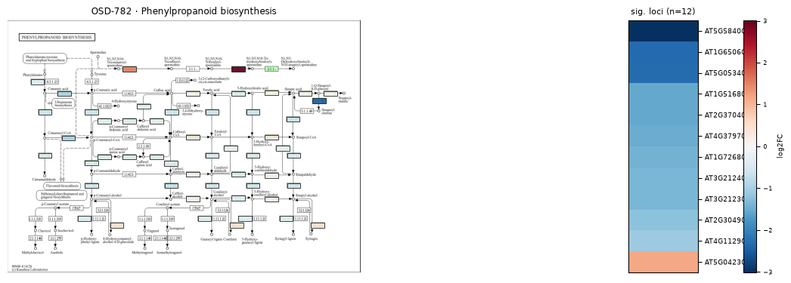

### ath00908 — Zeatin biosynthesis  ·  7 significant genes

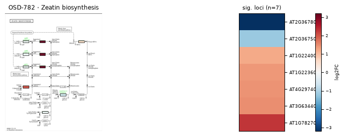

### ath00941 — Flavonoid biosynthesis  ·  6 significant genes

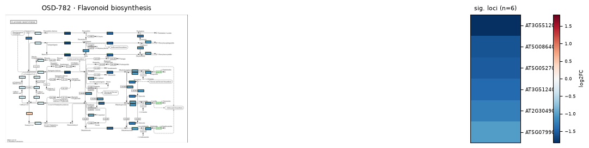

### ath04712 — Circadian rhythm - plant  ·  6 significant genes

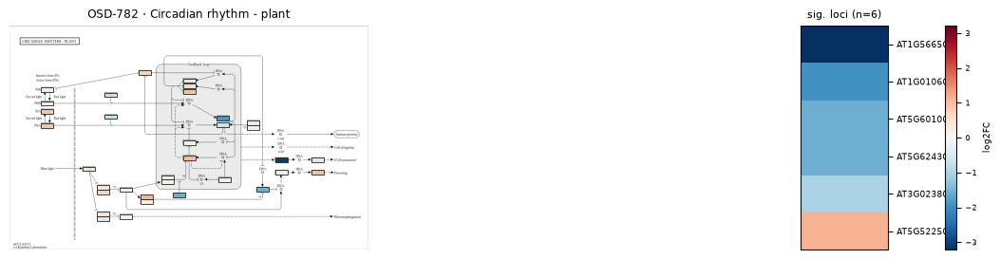

### ath00480 — Glutathione metabolism  ·  6 significant genes

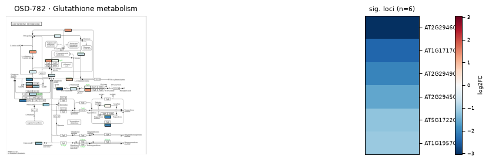

### ath00010 — Glycolysis / Gluconeogenesis  ·  5 significant genes

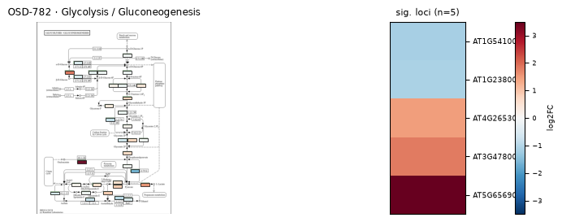

### ath00710 — Carbon fixation (Calvin cycle)  ·  4 significant genes

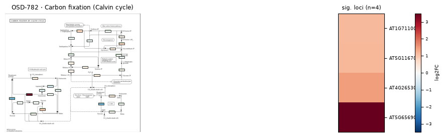

### ath00592 — alpha-Linolenic acid (jasmonate) metabolism  ·  4 significant genes

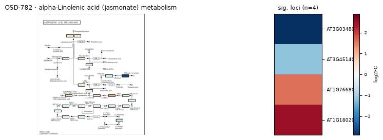

### ath00360 — Phenylalanine metabolism  ·  4 significant genes

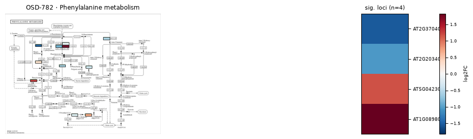
